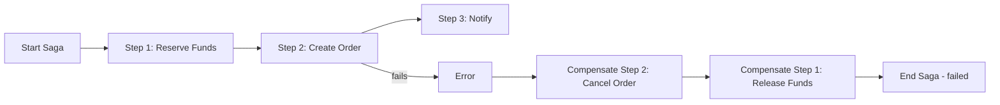
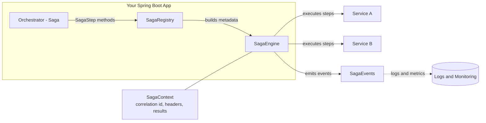

# Firefly OpenCore Banking — Transactional Engine (SAGA Orchestrator)

  

Lightweight, in-memory Saga orchestrator for Spring Boot 3 used within the Firefly OpenCore Banking platform to coordinate transactional workflows across microservices. Each step is an external call (typically HTTP; messaging is also possible using your client of choice). The engine orchestrates ordering, concurrency, retries, timeouts, and compensation (inverse calls) without persisting state.

This library does not replace database transactions; it coordinates cross-service operations using the Saga pattern.

## Table of Contents
- [What is this?](#what-is-this)
- [The Saga pattern in 5 minutes](#the-saga-pattern-in-5-minutes)
- [Key concepts](#key-concepts)
- [Features](#features)
- [Architecture at a glance](#architecture-at-a-glance)
- [How it works](#how-it-works)
- [Quick start](#quick-start)
- [Complete step-by-step tutorial](#complete-step-by-step-tutorial)
- [Installation](#installation)
- [Annotations reference](#annotations-reference)
- [Step inputs + SagaResult](#step-inputs-typed-dsl-and-typed-results-sagaresult)
- [Parameter injection](#parameter-injection-in-step-signatures-multi-parameter)
- [Programmatic saga execution](#programmatic-saga-execution-fluent-flexible)
- [Observability](#observability)
- [HTTP integration](#http-integration)
- [Limitations & non-goals](#limitations--non-goals)
- [Compatibility](#compatibility)
- [Common pitfalls (FAQ)](#common-pitfalls-faq)
- [Tests](#tests)
- [License](#license)

## What is this?
The Transactional Engine is a small library that lets you declare Sagas using annotations and execute them in memory:
- You model a business flow as a set of steps with dependencies (a DAG).
- Each step is a method that typically performs an external service call.
- If any step fails, previously completed steps are compensated by calling their inverse methods.

It is designed to be simple, explicit and suitable for orchestrating cross-service operations in OpenCore Banking domains (payments, account operations, order flows, etc.).

## The Saga pattern in 5 minutes
Sagas are a pattern for achieving reliable outcomes across multiple services without using distributed ACID transactions. Each service performs a local transaction and publishes an event or returns a result. If something fails mid‑way, previously completed transactions are compensated by executing explicitly defined inverse operations.

- Orchestration vs. choreography
  - Orchestration: a central orchestrator (this library) directs the steps and compensations.
  - Choreography: services react to events and coordinate themselves. No central brain.
- Local transactions: each step should commit changes atomically in its own service/database.
- Compensation: define a reversible action (refund, release, cancel) to undo business effects.
- When to use: cross‑service workflows such as payments, orders, account provisioning.
- When not to use: single‑service operations that fit well into a single DB transaction or require strict serializability across services.

Simple flow with failure and compensation:



## Key concepts
- Saga: a named workflow composed of ordered steps with explicit compensation.
- Step: a unit of work (usually an external call) that may depend on other steps.
- Dependency DAG: dependsOn declares a directed acyclic graph; steps in the same layer run concurrently.
- Compensation: inverse operation invoked for previously completed steps if the saga fails.
- SagaContext: holds correlation id, headers to propagate, per‑step metrics and results.
- Idempotency: optional per‑run short‑circuit via idempotencyKey to skip a step within the same run.
- Resilience controls: retry, fixed backoff, and per‑attempt timeout.
- Observability: lifecycle callbacks via SagaEvents and optional aspect logs.

## Features
- Annotations + AOP
  - `@EnableTransactionalEngine` — bootstraps engine, registry, and aspects
  - `@Saga(name)` — marks a class as an orchestrator
  - `@SagaStep(id, compensate, dependsOn?, retry?, backoffMs?, timeoutMs?, idempotencyKey?)`
- Execution model
  - Builds a DAG from `dependsOn`; executes steps layer-by-layer
  - Steps in the same layer run concurrently
  - On failure, compensates completed steps in reverse completion order
- Per-step controls
  - Retry with fixed backoff and per-attempt timeout
  - Per-run idempotency using `idempotencyKey` (skips the step within the same saga run if the key has already been used)
- Context and results
  - `SagaContext` stores correlation id, outbound headers, per-step status/attempts/latency, and step results
- Observability
  - Emits lifecycle events via `SagaEvents` (default `SagaLoggerEvents` logs JSON-friendly key=value entries)
  - Minimal `StepLoggingAspect` for raw method invocation latency
- HTTP integration (WebClient)
  - `HttpCall` helper to propagate `X-Transactional-Id` and custom headers from `SagaContext`
- In-memory only
  - No persistence of saga state. Simple and fast within a single JVM process

## Architecture at a glance
Before diving into code, here’s the mental model for how this library integrates with your Spring Boot app. The registry discovers your @Saga classes and steps at startup; the engine executes the DAG at runtime, propagates context into outbound calls, and emits lifecycle events for logs/metrics. Use this map to orient yourself before the Quick start and How it works sections:



- The registry scans for @Saga classes and @SagaStep methods at startup.
- The engine builds layers from the step DAG and runs steps concurrently per layer.
- SagaContext carries correlation and headers into outbound calls (HTTP, messaging).
- SagaEvents provides hooks for logs/metrics/tracing.

## How it works
- Discovery
  - The `SagaRegistry` scans the Spring context for `@Saga` beans and their `@SagaStep` methods (and compensation methods by name), validates the DAG (no cycles, dependencies exist), and keeps metadata.
- Execution
  - The `SagaEngine` builds topological layers from the step graph and executes one layer at a time.
  - Steps in the same layer run concurrently. Results are stored in `SagaContext` under the step id.
  - For each step the engine applies (when configured): retry with fixed backoff, per-attempt timeout, and per-run idempotency.
- Failure & compensation
  - If any step fails, the engine aborts remaining layers and compensates already completed steps in reverse completion order.
  - Compensation is best-effort: errors during compensation are logged and swallowed so that remaining compensations can still run.
- Compensation argument resolution
  - If a compensation method expects a business argument, the engine will pass:
    1) the original step input if compatible by type; else
    2) the step result if compatible by type; else
    3) null (especially when only `SagaContext` is expected).


## Quick start
Follow this step-by-step guide to model and run your first saga.

1) Enable the engine

```java
@EnableTransactionalEngine
@SpringBootApplication
public class App { }
```

2) Define request models

```java
public record ReserveCmd(String customerId, long amountCents) {}
public record CreateOrderCmd(String customerId, long amountCents) {}
```

3) Create the orchestrator

```java
@Saga(name = "PaymentSaga")
@Service
public class PaymentOrchestrator {
  private final WebClient accounts;
  private final WebClient orders;

  public PaymentOrchestrator(WebClient.Builder builder) {
    this.accounts = builder.baseUrl("http://accounts/api/v1").build();
    this.orders   = builder.baseUrl("http://orders/api/v1").build();
  }

  @SagaStep(
      id = "reserveFunds",
      compensate = "releaseFunds",
      retry = 2,
      backoffMs = 300,
      timeoutMs = 5000
  )
  public Mono<Void> reserveFunds(ReserveCmd cmd, SagaContext ctx) {
    return HttpCall.propagate(
        accounts.post().uri("/balances/reservations").bodyValue(Map.of(
            "customerId", cmd.customerId(),
            "amountCents", cmd.amountCents()
        )), ctx
    ).retrieve().bodyToMono(Void.class);
  }

  public Mono<Void> releaseFunds(ReserveCmd cmd, SagaContext ctx) {
    return HttpCall.propagate(
        accounts.post().uri("/balances/release").bodyValue(Map.of(
            "customerId", cmd.customerId(),
            "amountCents", cmd.amountCents()
        )), ctx
    ).retrieve().bodyToMono(Void.class);
  }

  @SagaStep(
      id = "createOrder",
      dependsOn = {"reserveFunds"},
      compensate = "cancelOrder",
      timeoutMs = 5000
  )
  public Mono<Long> createOrder(CreateOrderCmd cmd, SagaContext ctx) {
    return HttpCall.propagate(
        orders.post().uri("/orders").bodyValue(Map.of(
            "customerId", cmd.customerId(),
            "amountCents", cmd.amountCents()
        )), ctx
    ).retrieve().bodyToMono(Long.class);
  }

  public Mono<Void> cancelOrder(Long orderId, SagaContext ctx) {
    return HttpCall.propagate(
        orders.post().uri("/orders/{id}/cancel", orderId), ctx
    ).retrieve().bodyToMono(Void.class);
  }
}
```

4) Run the saga

```java
@Service
public class PaymentService {
  private final SagaEngine engine;

  public PaymentService(SagaEngine engine) { this.engine = engine; }

  public Mono<Long> process(ReserveCmd reserveCmd, CreateOrderCmd createCmd) {
    SagaContext ctx = new SagaContext(); // auto-generates correlationId (UUID)
    ctx.putHeader("X-User-Id", "123");   // propagate custom headers downstream

    StepInputs inputs = StepInputs.builder()
        .forStepId("reserveFunds", reserveCmd)
        .forStepId("createOrder", createCmd)
        .build();

    return engine
        .execute("PaymentSaga", inputs, ctx)
        .map(r -> r.resultOf("createOrder", Long.class).orElse(null));
  }
}
```

5) What to expect

- Steps within the same layer run concurrently; createOrder waits for reserveFunds thanks to dependsOn.
- If any step fails, the engine compensates already-finished steps in reverse completion order.
- Structured logs are emitted (see Observability); all HTTP calls include `X-Transactional-Id` and your custom headers.

## Complete step-by-step tutorial
If you want a full, realistic, end-to-end tutorial that walks through every feature (DAG modeling, retries/backoff/timeouts, per-run idempotency, compensation semantics, HTTP header propagation, observability hooks, parameter injection, and the new StepInputs DSL with lazy resolvers), read:

- TUTORIAL.md — Travel Booking Saga deep-dive

It includes:
- Visual DAG and compensation plan
- Spring wiring with @EnableTransactionalEngine
- Multi-parameter injection examples using @FromStep, @Header, @Headers, and SagaContext
- Building inputs with StepInputs.builder(), including lazy resolvers that depend on previous results and headers
- Executing sagas by name and programmatically with a fluent builder
- Failure walkthrough with compensation order and context statuses
- Practical guidance on timeouts, retries, and idempotency
- Testing patterns with Reactor StepVerifier

## Installation
Maven

```xml
<dependency>
  <groupId>com.catalis</groupId>
  <artifactId>lib-transactional-engine</artifactId>
  <version>1.0.0-SNAPSHOT</version>
</dependency>
```

Gradle (Kotlin DSL)

```kotlin
dependencies {
  implementation("com.catalis:lib-transactional-engine:1.0.0-SNAPSHOT")
}
```

## Annotations reference
| Annotation | Purpose | Key attributes | Notes |
| --- | --- | --- | --- |
| `@EnableTransactionalEngine` | Enables the Transactional Engine Spring configuration: scans for `@Saga` beans, wires `SagaRegistry`, `SagaEngine`, default `SagaEvents`, and the `StepLoggingAspect`. | — | Add on a Spring `@Configuration` (often your `@SpringBootApplication`). |
| `@Saga(name)` | Marks a class as an orchestrator with a human-friendly unique name. Use the same name when invoking `SagaEngine.execute(name, ...)`. | `name` (required) | Name must be unique across sagas. |
| `@SagaStep` | Declares a saga step and its compensation. | `id` (required); `compensate` (required); `dependsOn[]`; `retry`; `backoffMs`; `timeoutMs`; `idempotencyKey` | Step and compensation method must be on the same class. |

Supported step method signatures
- (InputType input, SagaContext ctx)
- (InputType input)
- (SagaContext ctx)
- ()

Return types
- Reactor Mono<T> preferred. Plain T is supported and will be wrapped using `Mono.justOrEmpty`.

Compensation methods
- Declared on the same class, referenced by name via `compensate`.
- Signatures mirror step signatures. When a business argument is expected, the engine will try to pass:
  1) the original step input (if assignable), else
  2) the step result (if assignable), else
  3) null. SagaContext is also injected when declared.

Validation and common errors
- Duplicate step ids in the same saga: IllegalStateException.
- dependsOn references a missing step: IllegalStateException.
- Cycles in the dependency graph: IllegalStateException (validated at startup).
- Missing compensation method by name: IllegalStateException.

Minimal example
```java
@Saga(name = "ExampleSaga")
@Service
class Example {
  @SagaStep(id = "a", compensate = "undoA")
  Mono<String> a(SagaContext ctx) { return Mono.just("ok"); }
  Mono<Void> undoA(String result, SagaContext ctx) { return Mono.empty(); }
}
```

## Programmatic saga execution (fluent, flexible)
In addition to the classic annotation-based discovery and execution, you can now build and run sagas programmatically using a fluent builder and functional step handlers. This is useful when you want to:
- Define a saga within a service/module without annotations
- Compose steps dynamically
- Unit test flows without Spring scanning

Key ideas:
- StepHandler<I,O> is a functional interface: implement execute(input, ctx) returning Mono<O>. Optionally override compensate(arg, ctx) to provide compensation.
- SagaBuilder produces a SagaDefinition that can be executed with the existing SagaEngine.
- The engine prefers handler-based execution when a handler is present; otherwise it falls back to the classic reflection-based method invocation.

Example:

```java
import com.catalis.transactionalengine.core.SagaContext;
import com.catalis.transactionalengine.engine.SagaEngine;
import com.catalis.transactionalengine.engine.StepHandler;
import com.catalis.transactionalengine.engine.StepInputs;
import com.catalis.transactionalengine.registry.SagaBuilder;
import com.catalis.transactionalengine.registry.SagaDefinition;
import reactor.core.publisher.Mono;

// Build saga definition fluently
SagaDefinition transferSaga = SagaBuilder.saga("transfer")
    .step("debit")
        .timeoutMs(2_000)
        .retry(2)
        .backoffMs(100)
        .handler((StepHandler<DebitRequest, Receipt>) (in, ctx) ->
            paymentService.debit(in) // Mono<Receipt>
        )
        .add()
    .step("credit")
        .dependsOn("debit")
        .handler((StepHandler<CreditRequest, Receipt>) (in, ctx) ->
            paymentService.credit(in)
        )
        .add()
    .build();

// Execute
SagaContext ctx = new SagaContext();
StepInputs inputs = StepInputs.builder()
    .forStepId("debit", new DebitRequest(/*...*/))
    .forStepId("credit", new CreditRequest(/*...*/))
    .build();
Mono<com.catalis.transactionalengine.core.SagaResult> result = sagaEngine.execute(transferSaga, inputs, ctx);

// Optionally block in non-reactive boundary
com.catalis.transactionalengine.core.SagaResult sagaResult = result.block();
```

Handler-based compensation:

```java
StepHandler<DebitRequest, Receipt> debitHandler = new StepHandler<>() {
    @Override
    public Mono<Receipt> execute(DebitRequest in, SagaContext ctx) {
        return paymentService.debit(in);
    }
    @Override
    public Mono<Void> compensate(Object arg, SagaContext ctx) {
        // arg will be either original input or previous result (pick what you need)
        DebitRequest in = (DebitRequest) arg;
        return paymentService.refund(in).then();
    }
};

SagaDefinition saga = SagaBuilder.saga("with-compensation")
    .step("debit").handler(debitHandler).add()
    .build();
```

Notes:
- All per-step knobs (retry, backoffMs, timeoutMs, idempotencyKey, dependsOn) are supported by the builder and honored by the engine.
- Classic annotation-based usage is unchanged. You can freely mix: a step may have both annotation-discovered method and a handler, and the engine will prefer the handler if present.
- Observability, idempotency and compensation semantics remain the same as described above.

## Step inputs: typed DSL and typed results (SagaResult)
To eliminate Map<String,Object> and stringly-typed step ids from the public API while increasing expressiveness, the engine provides a typed StepInputs DSL and a new execution API that returns a typed SagaResult.

Preferred execution API:
- Mono<SagaResult> execute(String sagaName, StepInputs inputs, SagaContext ctx)
- Mono<SagaResult> execute(SagaDefinition saga, StepInputs inputs, SagaContext ctx)

Backward compatibility: Map-based run(...) overloads remain available but are deprecated and will be removed in a future release. Use execute(...) instead.

Basic usage (programmatic SagaDefinition):

```java
SagaDefinition def = SagaBuilder.saga("S1")
  .step("a").handler((StepHandler<String, String>) (in, ctx) -> Mono.just("A-" + in)).add()
  .step("b").dependsOn("a").handler((StepHandler<Void, String>) (in, ctx) -> Mono.just("B" + ctx.getResult("a"))).add()
  .build();

SagaContext ctx = new SagaContext();

StepInputs inputs = StepInputs.builder()
  .forStepId("a", "in")
  .build();

var sagaResult = sagaEngine.execute(def, inputs, ctx).block();
// sagaResult.resultOf("a", String.class).get().equals("A-in");
// sagaResult.resultOf("b", String.class).get().equals("BA-in");
```

Accessing results and metadata with SagaResult
```java
SagaResult r = sagaEngine.execute(def, inputs, ctx).block();
if (r.isSuccess()) {
  String a = r.resultOf("a", String.class).orElseThrow();
  // Per-step info
  var out = r.steps().get("a");
  int attempts = out.attempts();
  long latency = out.latencyMs();
}
```

Dynamic inputs via resolvers
When an input depends on previously produced results and/or headers, provide a resolver that will be evaluated right before the step runs. The resolved value is cached so compensation can reuse it if needed.

```java
StepInputs inputs = StepInputs.builder()
  .forStepId("issueTicket", c -> new IssueTicketReq(
      (FlightRes) c.getResult("reserveFlight"),
      (PaymentReceipt) c.getResult("capturePayment"),
      c.headers().get("X-User-Id")
  ))
  .build();

sagaEngine.execute("TravelSaga", inputs, ctx);
```

Addressing steps without strings
If you prefer to avoid raw ids, you can pass a Method to the builder, and it will extract the @SagaStep id from it:

```java
class TravelSaga {
  @SagaStep(id = "reserveFlight", compensate = "cancelFlight")
  Mono<FlightReservation> reserveFlight(ReserveFlightReq req, SagaContext ctx) { ... }
}

Method m = TravelSaga.class.getMethod("reserveFlight", ReserveFlightReq.class, SagaContext.class);
StepInputs in = StepInputs.builder().forStep(m, new ReserveFlightReq(...)).build();
```

Note: A convenient API based on direct method references (e.g., TravelSaga::reserveFlight) may be added in a future version. For now, you can use forStepId or provide a Method.

Compensation semantics unchanged
- During compensation, the engine prefers passing the original step input to the compensation method when its parameter type matches; otherwise it tries the step result. The materialized inputs (concrete values plus any resolved and cached values) are used for this decision.

Migration
- Start using StepInputs.builder() and the execute(..., StepInputs, ...) API returning SagaResult.
- The Map-based overloads still work but are deprecated. Prefer the new API for type-safety and better IDE navigation.

## Observability
What is emitted and when
- onStart(sagaName, sagaId): fired once at the beginning of a run.
- onStepSuccess(sagaName, sagaId, stepId, attempts, latencyMs): after a step completes successfully.
- onStepFailed(sagaName, sagaId, stepId, error, attempts, latencyMs): after the final failed attempt of a step.
- onCompensated(sagaName, sagaId, stepId, error): called when a compensation method errors (successful compensations are not emitted in this MVP).
- onCompleted(sagaName, sagaId, success): fired once when the saga finishes (success=false if any step failed).

Default implementation
- `SagaLoggerEvents` emits structured key=value logs via SLF4J. Example lines:
```
saga_event=start saga=PaymentSaga sagaId=2f0b9c3d-... 
saga_event=step_success saga=PaymentSaga sagaId=2f0b9c3d-... stepId=reserveFunds attempts=1 latencyMs=120
saga_event=step_failed saga=PaymentSaga sagaId=2f0b9c3d-... stepId=createOrder attempts=3 latencyMs=5000 error=java.util.concurrent.TimeoutException
saga_event=compensated saga=PaymentSaga sagaId=2f0b9c3d-... stepId=reserveFunds error=
saga_event=completed saga=PaymentSaga sagaId=2f0b9c3d-... success=false
```

Customizing observability
- Provide your own `SagaEvents` bean to export metrics or traces:
```java
@Configuration
class ObservabilityConfig {
  @Bean
  SagaEvents sagaEvents() {
    return new SagaEvents() {
      @Override public void onStart(String saga, String id) { /* meter/tracing start */ }
      @Override public void onStepSuccess(String saga, String id, String step, int attempts, long ms) { /* metrics */ }
      @Override public void onStepFailed(String saga, String id, String step, Throwable err, int attempts, long ms) { /* metrics */ }
      @Override public void onCompensated(String saga, String id, String step, Throwable err) { /* metrics */ }
      @Override public void onCompleted(String saga, String id, boolean success) { /* meter/tracing end */ }
    };
  }
}
```

Additional AOP logs
- `StepLoggingAspect` wraps raw step method invocation and logs debug-level entries:
```
saga_aspect=step_invocation_success sagaId=2f0b9c3d-... stepId=reserveFunds latencyMs=118
saga_aspect=step_invocation_error   sagaId=2f0b9c3d-... stepId=createOrder  latencyMs=5002 error=...
```
To see these, enable DEBUG for the aspect logger, e.g. in Spring Boot:
```yaml
logging:
  level:
    com.catalis.transactionalengine.aop.StepLoggingAspect: DEBUG
```

## HTTP integration
WebClient with header propagation
```java
@Service
class ClientExample {
  private final WebClient accounts;
  ClientExample(WebClient.Builder builder) {
    this.accounts = builder.baseUrl("http://accounts").build();
  }
  Mono<Void> call(ReserveCmd cmd, SagaContext ctx) {
    return HttpCall.propagate(
        accounts.post().uri("/balances").bodyValue(cmd), ctx
    ).retrieve().bodyToMono(Void.class);
  }
}
```
What is propagated
- `X-Transactional-Id` header using the sagaId: `HttpCall.CORRELATION_HEADER` constant.
- Any custom headers you add via `ctx.putHeader(key, value)`.

Manual propagation with other clients
```java
import org.springframework.http.HttpHeaders;

public class PropagationExample {
  public static HttpHeaders buildHeaders(SagaContext ctx) {
    HttpHeaders headers = new HttpHeaders();
    headers.add(HttpCall.CORRELATION_HEADER, ctx.correlationId());
    ctx.headers().forEach(headers::add);
    return headers;
  }
  // Attach 'headers' to your client of choice (RestTemplate, OkHttp, Feign, etc.)
}
```

Timeouts and retries
- Engine-level: each step can set `timeoutMs`, `retry`, and `backoffMs` (applied per attempt by the engine).
- HTTP client-level: you may also configure client timeouts/retries. Avoid double-retrying the same error path unless intended.

Adding custom headers
```java
public class HeadersExample {
  public static void addHeaders(SagaContext ctx) {
    ctx.putHeader("X-User-Id", "123");
    ctx.putHeader("X-Tenant", "firefly-eu");
  }
}
```

## Parameter injection in step signatures (multi-parameter)
Many steps don’t need external inputs if the engine can inject what they need directly into the method signature.

New annotations:
- `@Input` or `@Input("key")`: injects the step input (or a value from a Map input by key).
- `@FromStep("stepId")`: injects the result of another step.
- `@Header("X-User-Id")`: injects a single outbound header from `SagaContext.headers()`.
- `@Headers`: injects the full headers map (`Map<String, String>`).
- `SagaContext` continues to be injected by type.

Example:

```java
@SagaStep(id = "issueTicket", compensate = "cancelTicket", dependsOn = {"reserveFlight", "capturePayment"})
public Mono<Ticket> issueTicket(
  @FromStep("reserveFlight") FlightReservation flight,
  @FromStep("capturePayment") PaymentReceipt payment,
  @Header("X-User-Id") String userId,
  SagaContext ctx
) {
  // ... call downstream service using flight + payment + userId
}
```

Engine behavior:
- The engine inspects `method.getParameters()` and resolves each argument by annotation or by type (for `SagaContext`).
- Backwards-compatible: legacy signatures still work: `(input, SagaContext)`, `(input)`, `(SagaContext)`, or `()`.
- Validation at startup: if any parameter cannot be resolved, the registry fails fast with a clear error message. It also
  validates that `@FromStep("id")` references an existing step and that `@Headers` is used with a `Map`-typed parameter.

Result: many steps no longer require callers to pass step inputs explicitly.

## Limitations & non-goals
- In-memory only: does not persist saga state or outbox messages.
- No local DB transactions, XA or 2PC.
- Exactly-once is not guaranteed; design your downstreams to be idempotent.
- Compensation is best-effort; compensation errors are logged and swallowed so others can continue.

## Compatibility
- Java 21+
- Spring Framework 6 / Spring Boot 3+
- Reactor (Mono)

## Common pitfalls (FAQ)
- Are compensation methods mandatory? Yes. Provide an opposite operation per step.
- What argument is passed to compensation? The engine tries step input, then step result (by type), else null; `SagaContext` is also passed when declared.
- How is idempotency used? Idempotency is per saga run: if `idempotencyKey` is set and was used earlier in the same run, the step is skipped.
- Can I use my own HTTP client? Yes. `HttpCall` is optional—any client works; just propagate headers yourself.

## Tests

How to run
- All tests: `mvn clean test` (also runs on `mvn clean install`).
- One test class: `mvn -Dtest=com.catalis.transactionalengine.engine.SagaEngineTest test`.
- One test method: `mvn -Dtest=SagaEngineTest#timeoutFailsStep test`.

What the suite covers
- Engine behavior (SagaEngineTest)
  - Successful execution stores results and emits events
  - Retry with backoff increments attempts and eventually succeeds
  - Timeout fails the step, emits failure, completes saga with success=false
  - Compensation is executed for completed steps when a dependent step fails
  - Per-run idempotency skips configured steps while marking them as DONE
- Context (SagaContextTest)
  - Stores statuses, attempts, latency and results per step; supports headers and idempotency keys
- Registry (SagaRegistryTest)
  - Scans @Saga/@SagaStep metadata, validates DAG (deps, cycles, compensation existence)
- HTTP helper (HttpCallTest)
  - Propagates X-Transactional-Id and custom headers from SagaContext
- Spring wiring (TransactionalEngineConfigurationTest)
  - @EnableTransactionalEngine registers SagaEngine, SagaRegistry, default SagaEvents
- End-to-end (FunctionalSagaIT)
  - Bootstraps a Spring context, runs a success saga and a failing saga with compensation and events

Notes
- JUnit 5 is used throughout; Reactor StepVerifier is used where applicable.
- Mockito/ByteBuddy may emit a Java agent warning during tests; it is harmless.
- Java 21+ is required (see badges and pom).

## License
Apache-2.0
