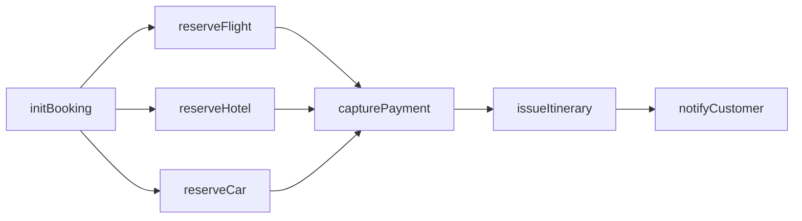

# Transactional Engine Deep‑Dive Tutorial — Orchestrating a Travel Booking Saga

This tutorial is a hands-on, step-by-step deep dive into the Firefly Transactional Engine using a scenario that is completely different from the README’s example. We will orchestrate a Travel Booking Saga coordinating multiple services: Flights, Hotels, Car Rentals, Payments, and Notifications. You’ll see how to model a DAG of steps, run them with concurrency, deal with failure and compensation, propagate headers over HTTP, and reason about idempotency, retries, and timeouts.

If you’re looking for the full reference, see README.md. Here we go deeper into the why and how with a realistic end-to-end flow.


## 0) Prerequisites
- Java 21+
- Spring Boot 3.x
- Reactor (Mono) — included with Spring WebFlux
- A build tool (Maven or Gradle)

Install the dependency:

Maven
```xml
<dependency>
  <groupId>com.catalis</groupId>
  <artifactId>lib-transactional-engine</artifactId>
  <version>1.0.0-SNAPSHOT</version>
</dependency>
```

Gradle (Kotlin DSL)
```kotlin
dependencies {
  implementation("com.catalis:lib-transactional-engine:1.0.0-SNAPSHOT")
}
```


## 1) Enable the engine in your Spring Boot app
Add the `@EnableTransactionalEngine` annotation to a configuration class (commonly your main `@SpringBootApplication`).

```java
import com.catalis.transactionalengine.annotations.EnableTransactionalEngine;
import org.springframework.boot.autoconfigure.SpringBootApplication;

@EnableTransactionalEngine
@SpringBootApplication
public class App {
  public static void main(String[] args) {
    org.springframework.boot.SpringApplication.run(App.class, args);
  }
}
```

What this does:
- Registers SagaEngine, SagaRegistry, and default observability (`SagaEvents`).
- Scans for your `@Saga` classes and their `@SagaStep` methods at startup.


## 2) Problem definition — Travel booking, end to end
We need to orchestrate a customer’s trip:
- Reserve a flight
- Reserve a hotel
- Optionally reserve a car
- Finally capture payment and issue an itinerary

Key points for this scenario:
- Flight, Hotel, and Car reservations can be attempted concurrently after we create an internal booking record.
- Payment capture should only happen after all reservations confirm.
- If any reservation fails (or payment fails), we must undo previously completed reservations (cancel flight/hotel/car) and mark the booking as failed.
- We must propagate a correlation id and custom headers across all HTTP calls for traceability.

We will model this with a DAG, set per-step retries and timeouts, and specify compensations for each reversible step.


## 3) Define request/response models (inputs/outputs)
Create simple records/POJOs for the inputs to our steps. Keep them minimal for clarity.

```java
public record InitBookingCmd(String customerId, String tripId) {}
public record FlightReq(String from, String to, String date, int passengers) {}
public record HotelReq(String city, String checkIn, String checkOut, int rooms) {}
public record CarReq(String city, String pickupDate, String dropoffDate, String category) {}
public record PaymentReq(String customerId, long totalCents, String currency) {}

public record FlightRes(String reservationId) {}
public record HotelRes(String reservationId) {}
public record CarRes(String reservationId) {}
public record Itinerary(String bookingId, String pdfUrl) {}
```

Notes:
- Outputs are returned by step methods and automatically stored in `SagaContext` under the step id.
- Compensation methods may receive either the original input or the result (whichever is type-compatible), plus `SagaContext` if declared.


## 4) Visualize the DAG
We’ll create a root step `initBooking` that allocates a bookingId in our system. Once we have that, we can attempt the three reservations in parallel. After all succeed, we `capturePayment`. Finally, we `issueItinerary` and send a `notifyCustomer` message.



Compensation plan (reverse of what succeeded):
- cancelCar, cancelHotel, cancelFlight (best-effort) if payment fails or later steps fail
- markBookingFailed if we had created a booking
- revokeItinerary/notifyFailure for post-payment steps


## 5) Orchestrator implementation (@Saga + @SagaStep)
We’ll wire WebClient instances to call downstreams. We use `HttpCall.propagate` to ensure `X-Transactional-Id` and custom headers travel with every request.

```java
import com.catalis.transactionalengine.annotations.Saga;
import com.catalis.transactionalengine.annotations.SagaStep;
import com.catalis.transactionalengine.core.SagaContext;
import com.catalis.transactionalengine.http.HttpCall;
import org.springframework.stereotype.Service;
import org.springframework.web.reactive.function.client.WebClient;
import reactor.core.publisher.Mono;

import java.util.Map;

@Saga(name = "TravelBookingSaga")
@Service
public class TravelBookingOrchestrator {
  private final WebClient flights;
  private final WebClient hotels;
  private final WebClient cars;
  private final WebClient payments;
  private final WebClient docs;
  private final WebClient notify;

  public TravelBookingOrchestrator(WebClient.Builder builder) {
    this.flights  = builder.baseUrl("http://flights/api").build();
    this.hotels   = builder.baseUrl("http://hotels/api").build();
    this.cars     = builder.baseUrl("http://cars/api").build();
    this.payments = builder.baseUrl("http://payments/api").build();
    this.docs     = builder.baseUrl("http://docs/api").build();
    this.notify   = builder.baseUrl("http://notify/api").build();
  }

  // 1) Initialize booking (idempotent, fast)
  @SagaStep(id = "initBooking", compensate = "markBookingFailed", timeoutMs = 2000)
  public Mono<String> initBooking(InitBookingCmd cmd, SagaContext ctx) {
    return HttpCall.propagate(
        docs.post().uri("/bookings").bodyValue(Map.of(
            "customerId", cmd.customerId(),
            "tripId", cmd.tripId()
        )), ctx
    ).retrieve().bodyToMono(String.class) // returns bookingId
     .doOnNext(bid -> ctx.putHeader("X-Booking-Id", bid)); // propagate booking id downstream
  }

  public Mono<Void> markBookingFailed(String bookingId, SagaContext ctx) {
    return HttpCall.propagate(
        docs.post().uri("/bookings/{id}/fail", bookingId), ctx
    ).retrieve().bodyToMono(Void.class);
  }

  // 2) Reserve flight (retriable)
  @SagaStep(id = "reserveFlight", compensate = "cancelFlight", dependsOn = {"initBooking"},
            retry = 2, backoffMs = 300, timeoutMs = 5000)
  public Mono<FlightRes> reserveFlight(FlightReq req, SagaContext ctx) {
    return HttpCall.propagate(
        flights.post().uri("/reservations").bodyValue(req), ctx
    ).retrieve().bodyToMono(FlightRes.class);
  }

  public Mono<Void> cancelFlight(FlightRes res, SagaContext ctx) {
    return HttpCall.propagate(
        flights.post().uri("/reservations/{id}/cancel", res.reservationId()), ctx
    ).retrieve().bodyToMono(Void.class);
  }

  // 3) Reserve hotel (parallel to flight)
  @SagaStep(id = "reserveHotel", compensate = "cancelHotel", dependsOn = {"initBooking"},
            retry = 2, backoffMs = 300, timeoutMs = 5000)
  public Mono<HotelRes> reserveHotel(HotelReq req, SagaContext ctx) {
    return HttpCall.propagate(
        hotels.post().uri("/reservations").bodyValue(req), ctx
    ).retrieve().bodyToMono(HotelRes.class);
  }

  public Mono<Void> cancelHotel(HotelRes res, SagaContext ctx) {
    return HttpCall.propagate(
        hotels.post().uri("/reservations/{id}/cancel", res.reservationId()), ctx
    ).retrieve().bodyToMono(Void.class);
  }

  // 4) Reserve car (optional). We'll demonstrate per-run idempotency.
  @SagaStep(id = "reserveCar", compensate = "cancelCar", dependsOn = {"initBooking"},
            idempotencyKey = "car:standard", timeoutMs = 4000)
  public Mono<CarRes> reserveCar(CarReq req, SagaContext ctx) {
    return HttpCall.propagate(
        cars.post().uri("/reservations").bodyValue(req), ctx
    ).retrieve().bodyToMono(CarRes.class);
  }

  public Mono<Void> cancelCar(CarRes res, SagaContext ctx) {
    return HttpCall.propagate(
        cars.post().uri("/reservations/{id}/cancel", res.reservationId()), ctx
    ).retrieve().bodyToMono(Void.class);
  }

  // 5) Capture payment after ALL reservations are confirmed
  @SagaStep(id = "capturePayment", compensate = "refundPayment",
            dependsOn = {"reserveFlight", "reserveHotel", "reserveCar"}, timeoutMs = 6000)
  public Mono<String> capturePayment(PaymentReq req, SagaContext ctx) {
    return HttpCall.propagate(
        payments.post().uri("/charges").bodyValue(req), ctx
    ).retrieve().bodyToMono(String.class); // chargeId
  }

  public Mono<Void> refundPayment(String chargeId, SagaContext ctx) {
    return HttpCall.propagate(
        payments.post().uri("/charges/{id}/refund", chargeId), ctx
    ).retrieve().bodyToMono(Void.class);
  }

  // 6) Issue itinerary
  @SagaStep(id = "issueItinerary", compensate = "revokeItinerary", dependsOn = {"capturePayment"}, timeoutMs = 3000)
  public Mono<Itinerary> issueItinerary(SagaContext ctx) {
    String bookingId = (String) ctx.getResult("initBooking");
    return HttpCall.propagate(
        docs.post().uri("/itineraries").bodyValue(Map.of("bookingId", bookingId)), ctx
    ).retrieve().bodyToMono(Itinerary.class);
  }

  public Mono<Void> revokeItinerary(Itinerary it, SagaContext ctx) {
    return HttpCall.propagate(
        docs.post().uri("/itineraries/revoke").bodyValue(Map.of("bookingId", it.bookingId())), ctx
    ).retrieve().bodyToMono(Void.class);
  }

  // 7) Notify customer; if it fails we log but do not attempt to undo previous business effects
  @SagaStep(id = "notifyCustomer", compensate = "notifyFailure", dependsOn = {"issueItinerary"})
  public Mono<Void> notifyCustomer(SagaContext ctx) {
    String bookingId = (String) ctx.getResult("initBooking");
    return HttpCall.propagate(
        notify.post().uri("/email").bodyValue(Map.of(
            "template", "itinerary",
            "bookingId", bookingId
        )), ctx
    ).retrieve().bodyToMono(Void.class);
  }

  public Mono<Void> notifyFailure(SagaContext ctx) {
    String bookingId = (String) ctx.getResult("initBooking");
    return HttpCall.propagate(
        notify.post().uri("/email").bodyValue(Map.of(
            "template", "failure",
            "bookingId", bookingId
        )), ctx
    ).retrieve().bodyToMono(Void.class);
  }
}
```

Why compensations like notifyFailure exist: the engine requires a compensation method per step. For steps that are logically non-reversible (e.g., sending an email), use a compensating action that records/alerts the failure (a “noop” is fine if you prefer). For read-only steps, you can also use a noop compensation.


## 6) Executing the saga
Use `SagaEngine` to run by name. Supply inputs for each step that expects an input. Steps that only need `SagaContext` can omit inputs.

```java
import com.catalis.transactionalengine.core.SagaContext;
import com.catalis.transactionalengine.engine.SagaEngine;
import org.springframework.stereotype.Service;
import reactor.core.publisher.Mono;

import java.util.Map;

@Service
public class TravelService {
  private final SagaEngine engine;

  public TravelService(SagaEngine engine) { this.engine = engine; }

  public Mono<Itinerary> bookTrip() {
    SagaContext ctx = new SagaContext();
    ctx.putHeader("X-User-Id", "u-123");
    ctx.putHeader("X-Tenant", "eu-west");

    Map<String, Object> inputs = Map.of(
        "initBooking", new InitBookingCmd("cust-100", "trip-42"),
        "reserveFlight", new FlightReq("MAD", "SFO", "2025-10-01", 2),
        "reserveHotel", new HotelReq("San Francisco", "2025-10-01", "2025-10-07", 1),
        "reserveCar", new CarReq("San Francisco", "2025-10-01", "2025-10-07", "standard"),
        "capturePayment", new PaymentReq("cust-100", 2_450_00, "USD")
    );

    return engine
        .run("TravelBookingSaga", inputs, ctx)
        .map(results -> (Itinerary) results.get("issueItinerary"));
  }
}
```

What runs when:
- `initBooking` runs first. Its result (bookingId) is stored in context.
- `reserveFlight`, `reserveHotel`, and `reserveCar` run concurrently (same DAG layer) after `initBooking`.
- `capturePayment` waits for all three reservations to complete.
- `issueItinerary` waits for payment; then `notifyCustomer` runs.


## 7) Failure walkthrough (deep dive)
Consider a failure in `reserveHotel` after `reserveFlight` succeeded, `reserveCar` succeeded, and before `capturePayment` runs.
- The engine stops scheduling further steps and begins compensation for completed steps.
- Compensation order is the reverse completion order (not reverse declaration order). If `reserveCar` finished last, it will be compensated first: `cancelCar`, then `cancelFlight`, and finally `markBookingFailed` for `initBooking` if nothing else succeeded.
- `SagaContext` statuses you should expect:
  - `reserveHotel = FAILED`
  - `reserveFlight = COMPENSATED`
  - `reserveCar = COMPENSATED`
  - `initBooking = COMPENSATED` (after `markBookingFailed`)
- The saga completes with success=false, and observability hooks (`SagaEvents`) are fired accordingly.

If failure happens after payment capture, the compensation will include `refundPayment` and then reservation cancellations as needed, followed by `markBookingFailed`. If `issueItinerary` fails, we’ll call `revokeItinerary` and optionally trigger `notifyFailure`.


## 8) Retries, backoff, and timeouts — choosing values
- Network steps (`reserveFlight`, `reserveHotel`) often benefit from small retries (1–3) with a short fixed backoff (100–500 ms). Avoid large retry counts that prolong user wait times.
- Use `timeoutMs` per step to bound user-perceived latency and avoid hanging requests; keep them aligned with downstream SLAs.
- Beware of double retries: if your HTTP client retries and the engine also retries, you may multiply attempts unintentionally.

Example configuration we used:
```java
@SagaStep(id = "reserveHotel", compensate = "cancelHotel", dependsOn = {"initBooking"},
          retry = 2, backoffMs = 300, timeoutMs = 5000)
```


## 9) Idempotency (per run) and when to use it
- `idempotencyKey` skips a step if the same key was used earlier in the SAME saga run.
- This is useful for optional or re-entrant steps that may get scheduled again within the run due to retries/timeouts or graph structure.
- Cross-run idempotency (between different saga runs or days) is not handled by the engine; design your downstream APIs to be idempotent using natural keys.

Example:
```java
@SagaStep(id = "reserveCar", compensate = "cancelCar", dependsOn = {"initBooking"},
          idempotencyKey = "car:standard")
```


## 10) Argument resolution for compensations (nuance)
When a compensation method expects a business argument, the engine resolves it in this order:
1) The original step input if assignable to the parameter type
2) Else, the step result if assignable
3) Else, null
Additionally, `SagaContext` is injected if declared. This is why we can write `cancelHotel(HotelRes res, SagaContext ctx)` — the engine passes the step result.


## 11) Observability — what to look for
Out-of-the-box, the engine emits lifecycle events via `SagaEvents`. The default `SagaLoggerEvents` prints structured key=value logs like:
```
saga_event=start saga=TravelBookingSaga sagaId=...
saga_event=step_success saga=TravelBookingSaga stepId=reserveFlight attempts=1 latencyMs=123
saga_event=step_failed saga=TravelBookingSaga stepId=reserveHotel attempts=3 latencyMs=5000 error=...
saga_event=completed saga=TravelBookingSaga success=false
```
You can provide a custom `SagaEvents` bean to integrate with metrics/tracing. For low-level timings of raw method invocations, enable DEBUG for `StepLoggingAspect`.


## 12) Testing the Travel Booking Saga
Use Reactor StepVerifier to assert success/failure and inspect results in `SagaContext`.

```java
import com.catalis.transactionalengine.core.SagaContext;
import com.catalis.transactionalengine.engine.SagaEngine;
import org.junit.jupiter.api.Test;
import reactor.test.StepVerifier;

import java.util.Map;

class TravelBookingTest {
  @Test
  void successfulBooking_emitsItinerary() {
    SagaEngine engine = /* injected */ null;
    SagaContext ctx = new SagaContext("corr-travel-1");

    StepVerifier.create(engine.run("TravelBookingSaga", Map.of(
        "initBooking", new InitBookingCmd("cust-100", "trip-42"),
        "reserveFlight", new FlightReq("MAD", "SFO", "2025-10-01", 2),
        "reserveHotel", new HotelReq("San Francisco", "2025-10-01", "2025-10-07", 1),
        "reserveCar", new CarReq("San Francisco", "2025-10-01", "2025-10-07", "standard"),
        "capturePayment", new PaymentReq("cust-100", 2_450_00, "USD")
    ), ctx))
    .expectNextMatches(results -> results.get("issueItinerary") != null)
    .verifyComplete();
  }
}
```

Tips:
- In tests, you can mock downstream services or stub WebClient calls.
- Inspect `ctx.getStatus(stepId)` to assert `DONE`, `FAILED`, or `COMPENSATED`.


## 13) Programmatic (no-annotations) variant — optional
You can build the same saga dynamically with the fluent builder and functional handlers. This is useful for module-scoped flows or heavy testing.

```java
import com.catalis.transactionalengine.core.SagaContext;
import com.catalis.transactionalengine.engine.SagaEngine;
import com.catalis.transactionalengine.engine.StepHandler;
import com.catalis.transactionalengine.registry.SagaBuilder;
import com.catalis.transactionalengine.registry.SagaDefinition;
import reactor.core.publisher.Mono;

SagaDefinition travel = SagaBuilder.saga("travel")
  .step("initBooking").timeoutMs(2000)
    .handler((StepHandler<InitBookingCmd, String>) (in, ctx) -> Mono.just("B-123"))
    .add()
  .step("reserveFlight").dependsOn("initBooking").retry(2).backoffMs(300).timeoutMs(5000)
    .handler((StepHandler<FlightReq, FlightRes>) (in, ctx) -> Mono.just(new FlightRes("F-1")))
    .add()
  .step("reserveHotel").dependsOn("initBooking").retry(2).backoffMs(300).timeoutMs(5000)
    .handler((StepHandler<HotelReq, HotelRes>) (in, ctx) -> Mono.just(new HotelRes("H-1")))
    .add()
  .step("reserveCar").dependsOn("initBooking").idempotencyKey("car:standard").timeoutMs(4000)
    .handler((StepHandler<CarReq, CarRes>) (in, ctx) -> Mono.just(new CarRes("C-1")))
    .add()
  .step("capturePayment").dependsOn("reserveFlight", "reserveHotel", "reserveCar").timeoutMs(6000)
    .handler((StepHandler<PaymentReq, String>) (in, ctx) -> Mono.just("charge-OK"))
    .add()
  .step("issueItinerary").dependsOn("capturePayment").timeoutMs(3000)
    .handler((StepHandler<Object, Itinerary>) (in, ctx) -> Mono.just(new Itinerary("B-123", "http://docs/it.pdf")))
    .add()
  .build();

SagaContext ctx = new SagaContext();
Map<String, Object> inputs = Map.of(
  "initBooking", new InitBookingCmd("cust-100", "trip-42"),
  "reserveFlight", new FlightReq("MAD", "SFO", "2025-10-01", 2),
  "reserveHotel", new HotelReq("San Francisco", "2025-10-01", "2025-10-07", 1),
  "reserveCar", new CarReq("San Francisco", "2025-10-01", "2025-10-07", "standard"),
  "capturePayment", new PaymentReq("cust-100", 2_450_00, "USD")
);
Mono<Map<String,Object>> result = sagaEngine.run(travel, inputs, ctx);
```


## 14) Practical guidance and edge cases
- Compensation must be best-effort and idempotent. Design downstream cancel/refund APIs so calling them twice is harmless.
- Concurrency: Steps in the same layer run concurrently. Ensure downstreams tolerate concurrent requests for the same logical customer/trip when applicable.
- Long chains: If your graph has many layers, consider grouping some calls behind a service to reduce orchestration complexity.
- Timeouts vs. retries: prefer smaller timeouts with a couple of retries over very large timeouts.
- Passing data: Use results in `SagaContext` to derive inputs for later steps (we used bookingId from `initBooking`). You can also place additional metadata into context headers for cross-cutting concerns.


## 15) Run tests in this repo
- All tests: `mvn clean test`
- One class: `mvn -Dtest=com.catalis.transactionalengine.engine.SagaEngineTest test`
- One method: `mvn -Dtest=SagaEngineTest#timeoutFailsStep test`


## 16) Summary
We built a Travel Booking Saga that:
- Models a DAG with concurrent reservations
- Uses per-step retries, backoff, and timeouts
- Propagates correlation id and custom headers over HTTP
- Compensates in reverse completion order on failure
- Demonstrates per-run idempotency and nuanced compensation argument resolution

This example is intentionally different from the README’s payment/order flow and goes deeper into the orchestration and failure semantics you’ll apply in production.

Happy trips and reliable compensations!