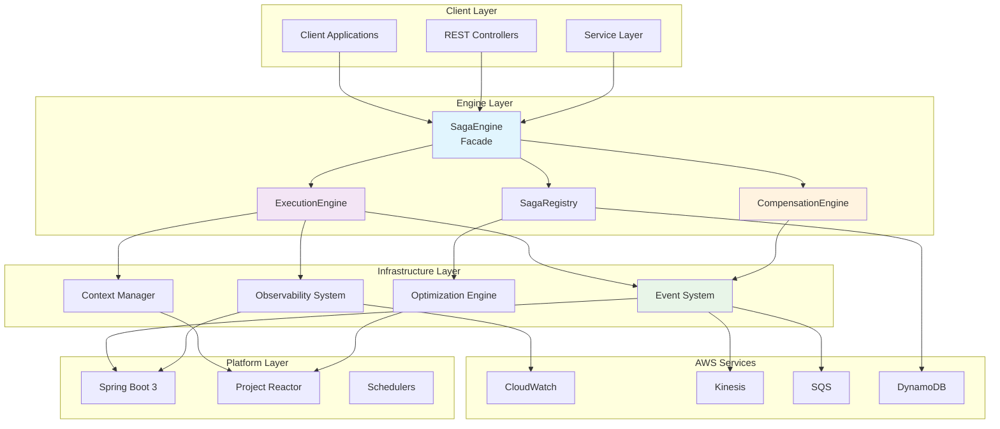
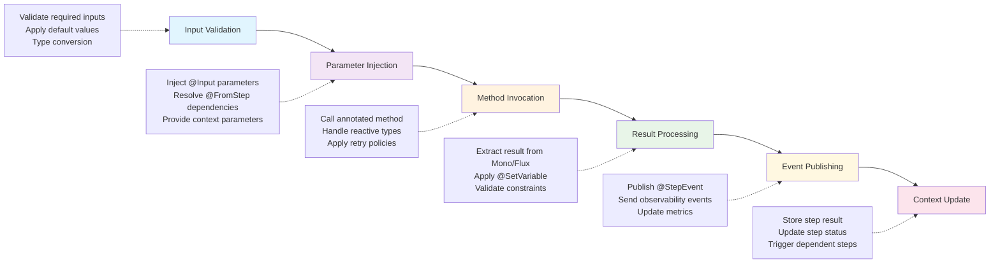
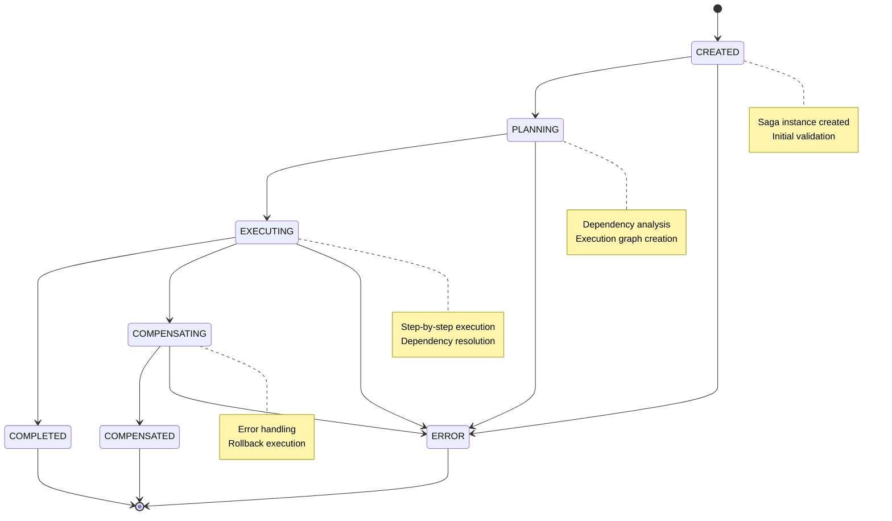

# Architecture Overview

Deep dive into the Transactional Engine's internal architecture, design principles, and execution model.

## Table of Contents

1. [High-Level Architecture](#high-level-architecture)
2. [Core Components](#core-components)
3. [Execution Model](#execution-model)
4. [Saga Lifecycle](#saga-lifecycle)
5. [Dependency Resolution](#dependency-resolution)
6. [Compensation Mechanism](#compensation-mechanism)
7. [Event System](#event-system)
8. [Optimization Strategies](#optimization-strategies)
9. [Threading and Concurrency](#threading-and-concurrency)
10. [AWS Integration Architecture](#aws-integration-architecture)
11. [Design Patterns](#design-patterns)
12. [Performance Considerations](#performance-considerations)

## High-Level Architecture

The Firefly Transactional Engine follows a modular, reactive architecture built on Spring Boot 3 and Project Reactor:



### Design Principles

1. **Reactive-First**: Built on non-blocking I/O with Project Reactor
2. **Annotation-Driven**: Declarative configuration with sensible defaults
3. **Event-Driven**: Comprehensive event publishing and observability
4. **Compensation-Based**: Automatic rollback through compensation patterns
5. **Cloud-Native**: First-class AWS integration with auto-configuration
6. **Performance-Oriented**: Graph optimization and parallel execution
7. **Extensible**: Plugin architecture for custom components

## Core Components

### SagaEngine

The main orchestration facade providing a unified API for saga execution:

```java
public class SagaEngine {
    private final SagaRegistry sagaRegistry;
    private final SagaEvents sagaEvents;
    private final StepEventPublisher stepEventPublisher;
    private final CompensationPolicy defaultCompensationPolicy;
    private final boolean autoOptimizationEnabled;
}
```

**Responsibilities:**
- Saga execution coordination
- Input validation and preparation
- Context management
- Result aggregation
- Error handling and compensation triggering

### SagaRegistry

Repository and factory for saga definitions:

```java
public class SagaRegistry {
    private final Map<String, SagaDefinition> sagaDefinitions;
    private final ApplicationContext applicationContext;
    
    public SagaDefinition getSagaDefinition(String sagaName);
    public SagaDefinition getSagaDefinition(Class<?> sagaClass);
    public List<String> getAllSagaNames();
}
```

**Responsibilities:**
- Saga discovery and registration
- Annotation processing
- Dependency graph construction
- Metadata extraction

### SagaDefinition

Immutable representation of a saga's structure:

```java
public class SagaDefinition {
    private final String name;
    private final String description;
    private final Class<?> sagaClass;
    private final CompensationPolicy compensationPolicy;
    private final Map<String, StepDefinition> steps;
    private final DirectedAcyclicGraph<StepDefinition> dependencyGraph;
    private final List<String> topologicalOrder;
}
```

**Responsibilities:**
- Step definition storage
- Dependency relationship modeling
- Execution order calculation
- Metadata provision

### StepDefinition

Represents an individual step within a saga:

```java
public class StepDefinition {
    private final String stepId;
    private final String description;
    private final Method method;
    private final List<String> dependencies;
    private final String compensationMethod;
    private final RetryPolicy retryPolicy;
    private final Duration timeout;
    private final boolean parallel;
    private final boolean required;
}
```

### ExecutionEngine

Core execution logic for processing saga steps:

```java
public class ExecutionEngine {
    public Mono<SagaResult> execute(SagaDefinition saga, StepInputs inputs, SagaContext context) {
        return createExecutionPlan(saga, context)
            .flatMap(plan -> executeSteps(plan, inputs, context))
            .onErrorResume(error -> handleExecutionError(error, saga, context));
    }
}
```

**Execution Flow:**
1. Create execution plan from saga definition
2. Resolve step dependencies
3. Execute steps in topological order
4. Handle parallel execution where possible
5. Manage compensation on failures

### CompensationEngine

Handles saga rollback through compensation:

```java
public class CompensationEngine {
    public Mono<Void> compensate(List<StepDefinition> completedSteps, 
                                SagaContext context, 
                                CompensationPolicy policy) {
        return filterStepsForCompensation(completedSteps, policy)
            .flatMap(steps -> executeCompensations(steps, context));
    }
}
```

## Execution Model

### Step Execution Pipeline

Each step goes through a standardized pipeline:



#### 1. Input Validation
- Validates required inputs are present
- Applies default values where configured
- Type conversion and validation

#### 2. Parameter Injection
- Injects `@Input` parameters from saga inputs
- Resolves `@FromStep` dependencies from previous steps
- Provides `@Variable`, `@Header`, and context parameters

#### 3. Method Invocation
- Calls the annotated method with injected parameters
- Handles reactive return types (Mono/Flux)
- Applies retry policies and timeouts

#### 4. Result Processing
- Extracts result from Mono/Flux
- Applies `@SetVariable` annotations
- Validates result constraints

#### 5. Event Publishing
- Publishes `@StepEvent` annotations
- Sends observability events
- Updates metrics and traces

#### 6. Context Update
- Stores step result in context
- Updates step status
- Triggers dependent steps

### Reactive Execution Flow

The engine leverages Project Reactor for non-blocking execution:

```java
public Mono<SagaResult> execute(SagaDefinition saga, StepInputs inputs, SagaContext ctx) {
    return Mono.fromCallable(() -> createExecutionPlan(saga, ctx))
        .flatMap(plan -> {
            return Flux.fromIterable(plan.getExecutableSteps())
                .flatMap(step -> executeStepWithDependencies(step, inputs, ctx))
                .then(Mono.just(buildSagaResult(ctx)));
        })
        .subscribeOn(Schedulers.boundedElastic())
        .publishOn(Schedulers.parallel());
}
```

## Saga Lifecycle

### Lifecycle Phases

1. **Discovery**: Annotation scanning and saga registration
2. **Planning**: Dependency analysis and execution graph creation
3. **Execution**: Step-by-step execution with dependency resolution
4. **Completion**: Result aggregation and success handling
5. **Compensation**: Error handling and rollback (if needed)
6. **Cleanup**: Resource cleanup and context finalization

### State Transitions



### Context Evolution

The `SagaContext` evolves throughout execution:

```java
// Initial state
SagaContext context = SagaContext.create("order-processing")
    .setVariable("customerId", "123")
    .setHeader("correlation-id", "abc-def");

// After step completion
context.setStepResult("validate-payment", paymentResult)
    .setVariable("paymentId", paymentResult.getPaymentId())
    .updateStepStatus("validate-payment", COMPLETED);
```

## Dependency Resolution

### Dependency Graph Construction

The engine builds a Directed Acyclic Graph (DAG) from step dependencies:

```java
public class DependencyGraphBuilder {
    public DirectedAcyclicGraph<StepDefinition> buildGraph(List<StepDefinition> steps) {
        DirectedAcyclicGraph<StepDefinition> graph = new DirectedAcyclicGraph<>();
        
        // Add vertices
        steps.forEach(graph::addVertex);
        
        // Add edges based on dependencies
        steps.forEach(step -> {
            step.getDependencies().forEach(depId -> {
                StepDefinition dependency = findStepById(steps, depId);
                graph.addEdge(dependency, step);
            });
        });
        
        return graph;
    }
}
```

### Execution Planning

The planner determines optimal execution order:

```java
public class ExecutionPlanner {
    public ExecutionPlan createPlan(SagaDefinition saga, SagaContext context) {
        List<String> topologicalOrder = saga.getTopologicalOrder();
        List<Set<String>> parallelGroups = identifyParallelGroups(saga);
        
        return ExecutionPlan.builder()
            .topologicalOrder(topologicalOrder)
            .parallelGroups(parallelGroups)
            .build();
    }
}
```

### Parallel Execution

Steps without interdependencies execute in parallel:

```java
public Mono<Void> executeParallelGroup(Set<StepDefinition> steps, 
                                      StepInputs inputs, 
                                      SagaContext context) {
    return Flux.fromIterable(steps)
        .flatMap(step -> executeStep(step, inputs, context))
        .then();
}
```

## Compensation Mechanism

### Compensation Strategies

#### COMPENSATE_ALL
Runs compensation for all completed steps, regardless of success status:

```java
private List<StepDefinition> selectStepsForCompensation_ALL(List<StepDefinition> steps) {
    return steps.stream()
        .filter(step -> context.getStepStatus(step.getStepId()) == COMPLETED)
        .collect(toList());
}
```

#### COMPENSATE_COMPLETED
Runs compensation only for successfully completed steps:

```java
private List<StepDefinition> selectStepsForCompensation_COMPLETED(List<StepDefinition> steps) {
    return steps.stream()
        .filter(step -> {
            StepStatus status = context.getStepStatus(step.getStepId());
            return status == COMPLETED && !step.hasErrors();
        })
        .collect(toList());
}
```

#### FAIL_FAST
Stops execution immediately on first error, no compensation:

```java
private Mono<SagaResult> handleFailFast(Throwable error, SagaContext context) {
    return Mono.just(SagaResult.builder()
        .failed()
        .error(error)
        .context(context)
        .build());
}
```

### Compensation Execution

Compensations run in reverse dependency order:

```java
public Mono<Void> executeCompensation(List<StepDefinition> steps, SagaContext context) {
    return Flux.fromIterable(steps)
        .sort((a, b) -> Integer.compare(b.getExecutionOrder(), a.getExecutionOrder())) // Reverse order
        .concatMap(step -> compensateStep(step, context))
        .then();
}
```

## Event System

### Event Types

The engine publishes various event types:

1. **Saga Events**: Lifecycle events (started, completed, failed, compensated)
2. **Step Events**: Step-level events (started, completed, failed, compensated)
3. **Custom Events**: User-defined events via `@StepEvent`

### Event Pipeline

```
Event Generation → Event Enrichment → Event Publishing → External Systems
```

### Event Publishers

#### Local Event Publisher
For in-process event handling:

```java
@Component
public class LocalStepEventPublisher implements StepEventPublisher {
    private final ApplicationEventPublisher eventPublisher;
    
    @Override
    public Mono<Void> publishEvent(StepEventEnvelope event) {
        return Mono.fromRunnable(() -> eventPublisher.publishEvent(event));
    }
}
```

#### Kinesis Event Publisher
For streaming events to AWS Kinesis:

```java
@Component
public class KinesisStepEventPublisher implements StepEventPublisher {
    private final KinesisAsyncClient kinesisClient;
    
    @Override
    public Mono<Void> publishEvent(StepEventEnvelope event) {
        return Mono.fromFuture(() -> kinesisClient.putRecord(buildPutRequest(event)))
            .then();
    }
}
```

## Optimization Strategies

### Graph Optimization

The engine applies several optimization strategies:

#### 1. Dead Code Elimination
Removes unreachable steps:

```java
public SagaDefinition optimizeDeadCode(SagaDefinition saga) {
    Set<String> reachableSteps = findReachableSteps(saga.getDependencyGraph());
    Map<String, StepDefinition> optimizedSteps = saga.getSteps().entrySet()
        .stream()
        .filter(entry -> reachableSteps.contains(entry.getKey()))
        .collect(toMap(Map.Entry::getKey, Map.Entry::getValue));
    
    return saga.withSteps(optimizedSteps);
}
```

#### 2. Parallel Group Identification
Identifies steps that can execute in parallel:

```java
public List<Set<String>> identifyParallelGroups(DirectedAcyclicGraph<StepDefinition> graph) {
    List<Set<String>> parallelGroups = new ArrayList<>();
    Set<StepDefinition> processed = new HashSet<>();
    
    while (processed.size() < graph.vertexSet().size()) {
        Set<StepDefinition> currentLevel = graph.vertexSet().stream()
            .filter(vertex -> !processed.contains(vertex))
            .filter(vertex -> allDependenciesProcessed(vertex, processed))
            .collect(toSet());
            
        parallelGroups.add(currentLevel.stream()
            .map(StepDefinition::getStepId)
            .collect(toSet()));
        processed.addAll(currentLevel);
    }
    
    return parallelGroups;
}
```

#### 3. Context Optimization
Optimizes context usage for frequently accessed data:

```java
public class OptimizedSagaContext extends SagaContext {
    private final Map<String, Object> fastAccessCache = new ConcurrentHashMap<>();
    
    @Override
    public <T> T getStepResult(String stepId, Class<T> type) {
        return (T) fastAccessCache.computeIfAbsent(
            stepId, 
            key -> super.getStepResult(key, type)
        );
    }
}
```

## Threading and Concurrency

### Thread Pool Configuration

The engine uses multiple thread pools for different workloads:

```java
@Configuration
public class ExecutorConfiguration {
    
    @Bean("sagaExecutor")
    public TaskExecutor sagaExecutor() {
        ThreadPoolTaskExecutor executor = new ThreadPoolTaskExecutor();
        executor.setCorePoolSize(10);
        executor.setMaxPoolSize(50);
        executor.setQueueCapacity(1000);
        executor.setThreadNamePrefix("saga-");
        return executor;
    }
    
    @Bean("compensationExecutor")
    public TaskExecutor compensationExecutor() {
        ThreadPoolTaskExecutor executor = new ThreadPoolTaskExecutor();
        executor.setCorePoolSize(5);
        executor.setMaxPoolSize(20);
        executor.setThreadNamePrefix("compensation-");
        return executor;
    }
}
```

### Reactive Schedulers

Different schedulers for different operations:

```java
public class ReactiveSchedulerConfig {
    public static final Scheduler SAGA_SCHEDULER = Schedulers.newBoundedElastic(
        50, 1000, "saga-scheduler");
    public static final Scheduler COMPENSATION_SCHEDULER = Schedulers.newBoundedElastic(
        20, 500, "compensation-scheduler");
    public static final Scheduler EVENT_SCHEDULER = Schedulers.newParallel(
        "event-publisher", 10);
}
```

### Concurrency Safety

The engine ensures thread safety through:

1. **Immutable Objects**: `SagaDefinition`, `StepDefinition` are immutable
2. **Concurrent Collections**: `ConcurrentHashMap` for mutable state
3. **Atomic Operations**: `AtomicReference` for status updates
4. **Copy-on-Write**: Context copying for parallel operations

## AWS Integration Architecture

### Auto-Configuration

Spring Boot auto-configuration detects AWS services:

```java
@Configuration
@ConditionalOnClass({
    DynamoDbAsyncClient.class,
    CloudWatchAsyncClient.class,
    KinesisAsyncClient.class
})
public class AwsTransactionalEngineAutoConfiguration {
    
    @Bean
    @ConditionalOnMissingBean(SagaEvents.class)
    public SagaEvents cloudWatchSagaEvents(CloudWatchAsyncClient cloudWatch) {
        return new CloudWatchSagaEvents(cloudWatch);
    }
    
    @Bean
    @ConditionalOnProperty(name = "transactional-engine.aws.kinesis.enabled")
    public StepEventPublisher kinesisStepEventPublisher(KinesisAsyncClient kinesis) {
        return new KinesisStepEventPublisher(kinesis);
    }
}
```

### Service Integration

#### CloudWatch Integration
```java
public class CloudWatchSagaEvents implements SagaEvents {
    private final CloudWatchAsyncClient cloudWatch;
    
    @Override
    public void sagaCompleted(String sagaName, String sagaId, Duration duration, SagaContext context) {
        MetricDatum metric = MetricDatum.builder()
            .metricName("saga_duration")
            .value(duration.toMillis())
            .unit(StandardUnit.MILLISECONDS)
            .dimensions(Dimension.builder().name("SagaName").value(sagaName).build())
            .build();
            
        cloudWatch.putMetricData(PutMetricDataRequest.builder()
            .namespace("TransactionalEngine")
            .metricData(metric)
            .build());
    }
}
```

#### Kinesis Integration
```java
public class KinesisStepEventPublisher implements StepEventPublisher {
    private final KinesisAsyncClient kinesis;
    private final String streamName;
    
    @Override
    public Mono<Void> publishEvent(StepEventEnvelope event) {
        PutRecordRequest request = PutRecordRequest.builder()
            .streamName(streamName)
            .partitionKey(event.getSagaId())
            .data(SdkBytes.fromUtf8String(serializeEvent(event)))
            .build();
            
        return Mono.fromFuture(kinesis.putRecord(request)).then();
    }
}
```

## Design Patterns

### Patterns Used

1. **Facade Pattern**: `SagaEngine` provides unified interface
2. **Builder Pattern**: `StepInputs.Builder`, `SagaResult.Builder`
3. **Strategy Pattern**: `CompensationPolicy` implementations
4. **Observer Pattern**: Event publishing system
5. **Template Method**: Step execution pipeline
6. **Registry Pattern**: `SagaRegistry` for saga discovery
7. **Chain of Responsibility**: Event publishing chain

### Extension Points

The architecture provides several extension points:

```java
// Custom step event publisher
@Component
public class CustomEventPublisher implements StepEventPublisher {
    @Override
    public Mono<Void> publishEvent(StepEventEnvelope event) {
        // Custom implementation
    }
}

// Custom saga events handler
@Component
public class CustomSagaEvents implements SagaEvents {
    @Override
    public void sagaStarted(String sagaName, String sagaId, SagaContext context) {
        // Custom implementation
    }
}

// Custom context provider
@Bean
public SagaContextProvider customContextProvider() {
    return (sagaName, correlationId) -> {
        return new CustomSagaContext(sagaName, correlationId);
    };
}
```

## Performance Considerations

### Optimization Techniques

1. **Graph Pre-computation**: Dependency graphs computed at startup
2. **Method Caching**: Reflection results cached for performance
3. **Context Pooling**: Context objects reused when possible
4. **Batch Event Publishing**: Events batched for efficiency
5. **Lazy Loading**: Step definitions loaded on demand

### Memory Management

- **Weak References**: For cached metadata to allow GC
- **Context Cleanup**: Automatic cleanup after saga completion
- **Resource Pooling**: Connection and thread pool management
- **Backpressure**: Built-in backpressure handling in reactive streams

### Monitoring Points

Key metrics to monitor:

- Saga execution time
- Step execution time
- Compensation frequency
- Thread pool utilization
- Memory usage
- Event publishing latency

This architecture provides a robust, scalable foundation for distributed transaction orchestration with comprehensive observability and cloud-native capabilities.