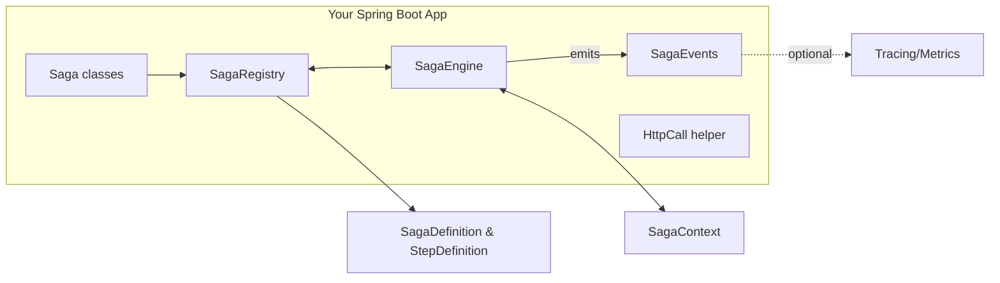
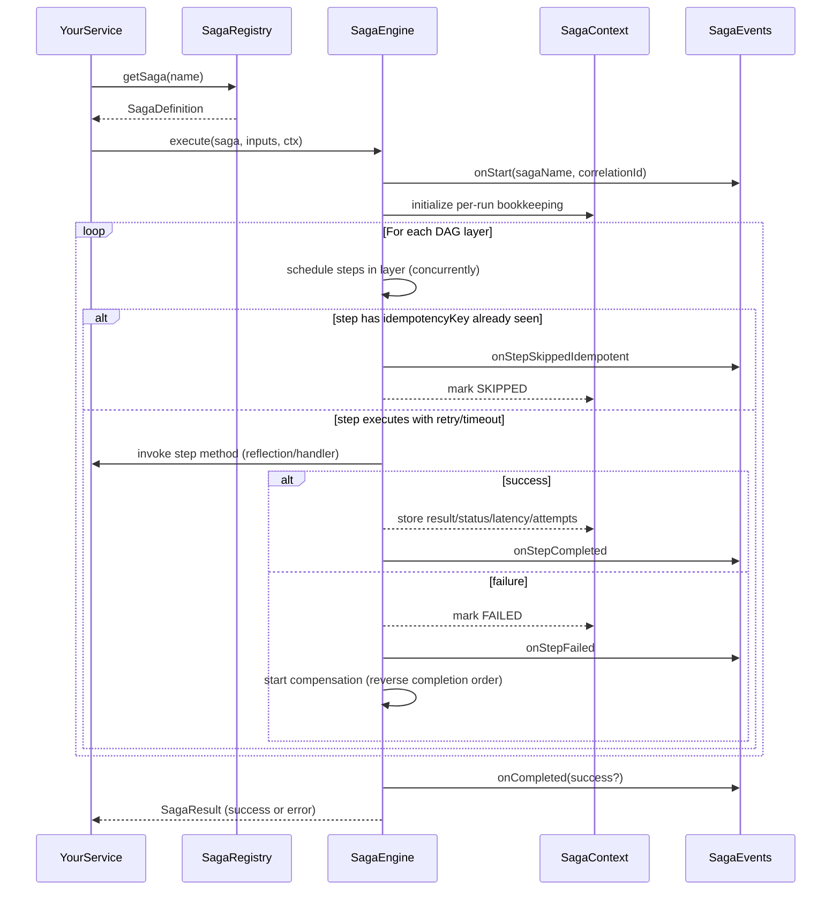
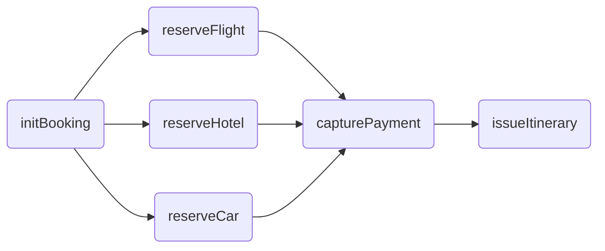
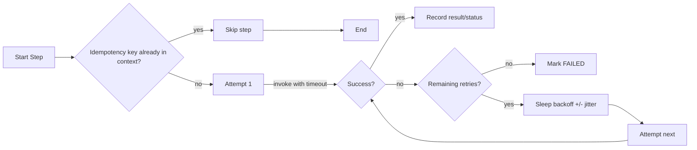
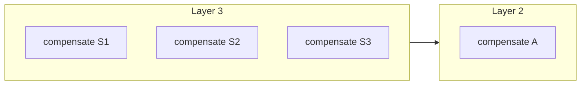
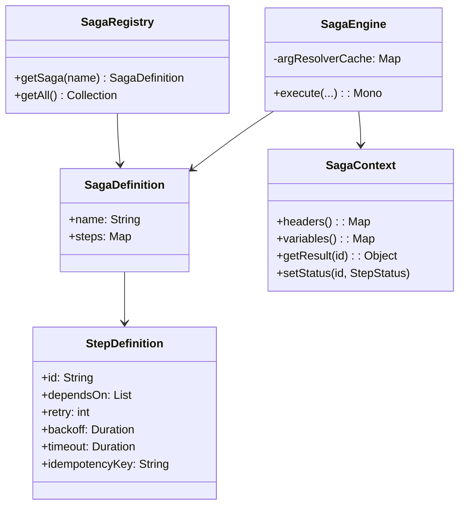

# Transactional Engine — Architecture, Design Decisions, and Performance Guide

This document explains how the in-memory saga orchestration library is built and why we made certain decisions. It includes visual diagrams and practical guidance so you can understand, extend, and operate it effectively.

If you are new to the library, start with README.md for a quick overview, then come back here for the deeper internals. For a hands-on, end-to-end walkthrough, see docs/TUTORIAL.md.

## Table of contents
- [Goals and constraints](#goals-and-constraints)
- [Architectural overview](#architectural-overview)
- [How execution works](#how-execution-works)
  - [Compensation policies](#compensation-policies)
- [Key design decisions](#key-design-decisions)
- [Performance and memory techniques](#performance-and-memory-techniques)
- [Memory footprint considerations](#memory-footprint-considerations)
- [Configuration knobs and trade-offs](#configuration-knobs-and-trade-offs)
- [Bean topology: singleton vs multiple SagaEngine beans](#bean-topology-singleton-vs-multiple-sagaengine-beans)
- [Class relationships (simplified)](#class-relationships-simplified)
- [Future extensions (non-goals today)](#future-extensions-non-goals-today)

## Goals and constraints
- In-memory orchestration: a single-JVM library with no persistence of saga state.
- Deterministic orchestration semantics: DAG of steps with compensation on failure.
- Developer ergonomics: annotation-based steps, parameter injection, and a typed API.
- Operational safety: timeouts, retries with backoff and optional jitter, per-run idempotency.

## Architectural overview

High-level components and their responsibilities:



- SagaRegistry: discovers `@Saga` beans and their `@SagaStep` methods, builds `SagaDefinition`/`StepDefinition`, validates DAG, resolves proxy-safe invocation methods. Then performs a second pass to discover `@ExternalSagaStep` (external steps) and `@CompensationSagaStep` (external compensations) on any Spring bean, wiring them into the target saga. External compensations take precedence over in-class ones; duplicate step ids (in-class vs external or between externals) are rejected.
- SagaEngine: executes the DAG layer-by-layer with concurrency, retries/backoff, and timeouts; stores results/metrics in `SagaContext`; compensates on failure; emits `SagaEvents`.
- SagaContext: per-execution, in-memory container for headers, variables, step statuses, results, attempts, and latencies.
- SagaEvents: pluggable observability sink; default logger-based sink is provided, with optional tracing/metrics integration.
- HttpCall: helper for propagating headers (like correlation id) on outbound HTTP calls.

## How execution works

From discovery to a completed (or compensated) run:



DAG layering (topological ordering) — steps in the same layer run concurrently:



Retry/backoff/timeout flow for a single step:



Compensation order is the reverse of the actual completion order of successful steps. With policy GROUPED_PARALLEL, compensations may run in parallel within the same original layer to speed up rollbacks.

### Compensation policies

The engine supports multiple compensation strategies:
- STRICT_SEQUENTIAL (default): compensate one step at a time in the exact reverse completion order.
- GROUPED_PARALLEL: compensate in batches by original execution layer, running independent compensations in parallel within each batch. This reduces rollback time for wide layers.
- RETRY_WITH_BACKOFF: sequential rollback with retry/backoff/timeout applied to each compensation (inherits step settings unless overridden per compensation).
- CIRCUIT_BREAKER: sequential rollback that opens a circuit (skips remaining compensations) when a compensation marked as critical fails.
- BEST_EFFORT_PARALLEL: runs all compensations in parallel; records errors via events without stopping others.

When to use which
- STRICT_SEQUENTIAL: when business invariants require strict ordering or participants are sensitive to concurrency.
- GROUPED_PARALLEL: when compensations are independent and idempotent; minimizes total rollback time.
- RETRY_WITH_BACKOFF: when compensations may transiently fail and benefit from bounded retries.
- CIRCUIT_BREAKER: when certain compensations are critical and subsequent rollbacks should be skipped if they fail.
- BEST_EFFORT_PARALLEL: when speed is paramount and partial failures are acceptable but should be observed.

How to configure
- Default Spring configuration wires STRICT_SEQUENTIAL. Override the SagaEngine bean to switch:

```java
@Configuration
class EnginePolicyConfig {
  @Bean
  SagaEngine sagaEngine(SagaRegistry registry, SagaEvents events) {
    return new SagaEngine(registry, events, SagaEngine.CompensationPolicy.GROUPED_PARALLEL);
  }
}
```

- In tests or programmatic usage:
```java
SagaEngine engine = new SagaEngine(registry, events, SagaEngine.CompensationPolicy.GROUPED_PARALLEL);
```

Compensation overrides (per step)
- `compensationRetry`, `compensationBackoffMs`, `compensationTimeoutMs` let you override the step’s resilience knobs specifically for compensation. `-1` values inherit step settings.
- `compensationCritical` marks a compensation as critical; used by CIRCUIT_BREAKER to decide when to open the circuit.

Observability of compensation
- Additional SagaEvents callbacks are emitted during rollback: `onCompensationStarted`, `onCompensationRetry`, `onCompensationSkipped`, `onCompensationCircuitOpen`, `onCompensationBatchCompleted`, and `onCompensated` (success or error).

Visual (grouped compensation by layer)


## Key design decisions

At a glance
- In-memory, single-JVM orchestrator for simplicity and speed; no persisted state. Intended for short-lived, in-process workflows.
- Deterministic execution over a DAG; compensation in reverse completion order.
- Annotation-first API with programmatic escape hatches when you need dynamic flows or test doubles.

Execution semantics (deterministic by design)
- DAG-first: compute topological layers; execute one layer at a time; steps within a layer run concurrently.
- Failure model: on first failure, stop scheduling new layers and compensate successful steps in reverse completion order. Optional grouped-parallel compensation speeds large rollbacks.

API & extensibility
- Convenience: @Saga + @SagaStep with parameter injection for clean signatures.
- Control: programmatic builder (SagaBuilder), StepHandler, and typed StepInputs bypass reflection on the hot path.
- Proxy-safe: registry resolves invocation methods on the actual Spring bean so AOP (@Transactional, aspects) remains effective.

Resilience & safety
- Per-step knobs (opt-in): retry with fixed/jittered backoff, per-attempt timeout, cpuBound scheduling hint, and per-run idempotency via idempotencyKey.
- Parameter injection rules (strict): exactly one implicit, unannotated non-SagaContext parameter (the step input) is allowed; everything else should be annotated (@Input, @FromStep, @FromCompensationResult, @CompensationError, @Header, @Headers, @Variable, @Variables). `@Required` enforces non-null after resolution. Misconfigurations fail fast.
- Idempotency scope: per run only; not a cross-run dedup store. Design downstream APIs to be naturally idempotent.

Observability & defaults
- Events: minimal logger-based SagaEvents out of the box; plug in metrics/tracing if present.
- Conservative defaults: backoff 100ms, timeout disabled (Duration.ZERO), unbounded per-layer concurrency unless capped via @Saga.layerConcurrency.

## Performance and memory techniques

Defaults (short and sane)
- Backoff: 100ms fixed (jitter optional). Timeout: disabled (Duration.ZERO). Layer concurrency: unbounded unless capped via @Saga.

Golden rules
- Keep steps non-blocking; if blocking is unavoidable, isolate it and mark cpuBound.
- Prefer a couple of fast retries over one long timeout.
- Keep payloads/results small; store only what you need in SagaContext.

1) Reflection/annotation caching (hot path)
- Arg resolvers compiled once per method and cached (ConcurrentHashMap). No repeated annotation scans.
- Tip: Prefer parameter annotations to manual context plumbing—clearer and free at runtime thanks to caching.
- Diagnostics: misconfigurations raise clear IllegalStateException on first use/startup.

2) One-time registry scan (proxy-safe)
- Single startup pass builds SagaDefinition/StepDefinition; resolves proxy-safe invocation methods against actual bean classes.
- Complexity ~ O(number of step/compensation methods). No steady-state scanning cost.

3) Minimal allocations on the hot path
- Per-run state in SagaContext uses concurrent maps/sets; read-only views avoid copying.
- StepInputs supports lazy resolvers evaluated just-in-time and reused for compensation.

4) Concurrency & scheduling
- Concurrent execution within a layer; cap with @Saga.layerConcurrency to protect CPU/memory and downstreams.
- cpuBound=true runs on Reactor parallel; I/O steps remain on I/O-appropriate schedulers.
- Avoid blocking inside steps; if needed, use a dedicated scheduler or handler to avoid starving pools.

5) Retries/backoff/jitter
- Fixed backoff by default; optional jitter/jitterFactor de-correlates waves of retries.
- Implementation uses ThreadLocalRandom to jitter around base backoff.
- Typical values: retry 1–3, backoff 100–500ms.

6) Per-attempt timeouts
- Bound each attempt to prevent hangs and wasted resources. Keep aligned with downstream SLAs.

7) Per-run idempotency
- idempotencyKey marks a step before execution; repeated keys within the same run are skipped (onStepSkippedIdempotent).
- Scope is intra-run only; not a durable dedup mechanism.

8) Thread-safe bookkeeping
- All SagaContext structures are concurrent to safely handle many steps running in the same layer.

9) Small, bounded surfaces
- Caches scale with code surface (@SagaStep count). SagaContext is per-execution and GC-eligible when complete.

Quick tuning checklist
- Cap fan-out layers (layerConcurrency) when downstreams are sensitive.
- Add jitter where many steps call the same downstream under load.
- Prefer more layers (shallower concurrency) over huge single layers when memory is tight.
- Keep objects small; store identifiers instead of large payloads when possible.

Diagnostics quick guide
- Check attempts/latencyMs in events to spot retries/timeouts quickly.
- Wire Micrometer/Tracing for timers/spans; look for scheduler contention and queueing.
- Slow rollbacks? Try GROUPED_PARALLEL and ensure compensations are idempotent and fast.

## Memory footprint considerations
- Caches (registry and argument resolvers) are unbounded but naturally sized by the number of discovered methods. Typical apps stabilize after startup.
- Per-execution `SagaContext` is created at the start of `execute/run` and becomes eligible for GC when the Mono completes and references are dropped.
- Step results are only stored if non-null; prefer lightweight DTOs for large payloads.

## Configuration knobs and trade-offs
- `layerConcurrency` (on `@Saga`): limit concurrent steps within a layer to control CPU/memory pressure.
- `retry/backoff/jitter/jitterFactor`: trade latency for resilience; jitter helps de-correlate retries under load.
- `timeout`: set per-step timeouts to bound latency; `0` disables.
- `cpuBound`: set to true for CPU-intensive work to keep I/O schedulers free.

## Class relationships (simplified)



## Future extensions (non-goals today)
- Persistent state store and resume/retry after process restarts.
- Pluggable schedulers/pools per step.
- Bounded caches with eviction policies for extremely large applications.

Tip: For a complete, runnable example that uses these concepts, see docs/TUTORIAL.md.


## Bean topology: singleton vs multiple SagaEngine beans

TL;DR
- Default to a single SagaEngine bean per microservice. It’s safe for concurrent reuse and gives the best cache/observability reuse.
- Consider multiple engines only when you truly need different defaults/policies or separate observability sinks.
- Multiple engines do not improve throughput by themselves and do not create dedicated thread pools.

### Context
- SagaEngine holds only immutable collaborators (SagaRegistry, SagaEvents, CompensationPolicy). Per-execution state lives in SagaContext, and the engine’s internal caches use thread-safe structures (ConcurrentHashMap). There is no cross-run mutable state. This makes the engine safe to reuse concurrently from many threads.

### Recommended default: single SagaEngine bean
- For most services, declare a single SagaEngine @Bean and reuse it for all saga executions. This maximizes cache reuse, minimizes allocations, and provides a single, consistent place to attach observability (SagaEvents) and defaults.

### When to consider multiple engines in the same microservice
- Distinct execution/rollback policies per bounded context
  - Example: payments sagas prefer GROUPED_PARALLEL compensation to speed rollbacks; fulfillment prefers STRICT_SEQUENTIAL for stronger ordering guarantees.
- Segregated observability pipelines
  - Route payments sagas to a different SagaEvents implementation (sampling, tags, sinks) than fulfillment/customer-support sagas.
- Controlled experimentation or feature flags
  - Run a subset of sagas through an alternate engine instance with different defaults without perturbing the primary engine.
- Organizational multi-tenancy boundaries
  - Hard isolation of event streams or admin controls by wiring different engine beans behind qualifiers. Note: concurrency/SLA isolation is primarily managed per saga via @Saga.layerConcurrency; multiple engines don’t create separate thread pools.

### Non-reasons to create multiple engines
- Throughput alone: the engine already executes steps concurrently within layers, and uses Reactor schedulers. Additional engine instances won’t bypass per-layer concurrency or materially increase throughput.
- “Isolation” of discovered sagas: all engines share the same SagaRegistry (built from the Spring ApplicationContext). Prefer naming and calling the desired saga; only split contexts if you truly need separate registries.

### Spring configuration examples

Single engine (recommended):
```java
@Configuration
class EngineConfig {
  @Bean
  SagaEngine sagaEngine(SagaRegistry registry, SagaEvents events) {
    return new SagaEngine(registry, events, SagaEngine.CompensationPolicy.STRICT_SEQUENTIAL);
  }
}
```

Multiple engines with qualifiers:
```java
@Configuration
class MultiEngineConfig {
  @Bean
  @Qualifier("paymentsEngine")
  SagaEngine paymentsEngine(SagaRegistry registry, PaymentsSagaEvents events) {
    return new SagaEngine(registry, events, SagaEngine.CompensationPolicy.GROUPED_PARALLEL);
  }

  @Bean
  @Qualifier("fulfillmentEngine")
  SagaEngine fulfillmentEngine(SagaRegistry registry, FulfillmentSagaEvents events) {
    return new SagaEngine(registry, events); // STRICT_SEQUENTIAL by default
  }
}
```

### Usage with qualifiers
```java
@Service
class PaymentsService {
  private final SagaEngine engine;
  PaymentsService(@Qualifier("paymentsEngine") SagaEngine engine) { this.engine = engine; }
}
```

### Operational notes and caveats
- Don’t create per-request engines: you’ll duplicate caches (argResolverCache) and increase GC pressure for no benefit.
- All engines operate over the same SagaRegistry in a single Spring context. If you truly need a different set of discovered sagas, consider separate application contexts or a filtered/alternate registry bean.
- Engine instances do not own dedicated scheduler pools; cpuBound steps use Reactor’s parallel scheduler.
