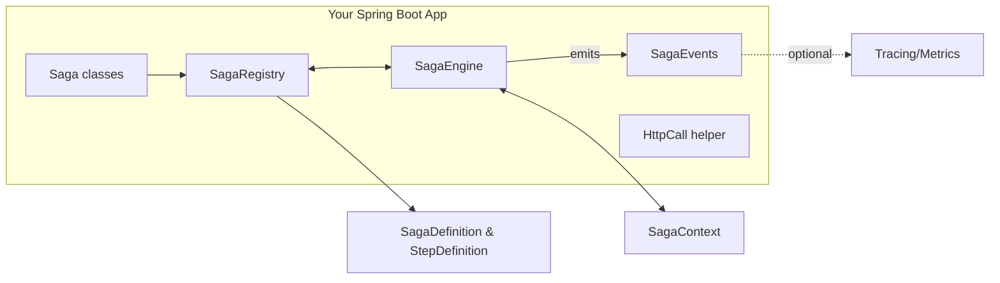
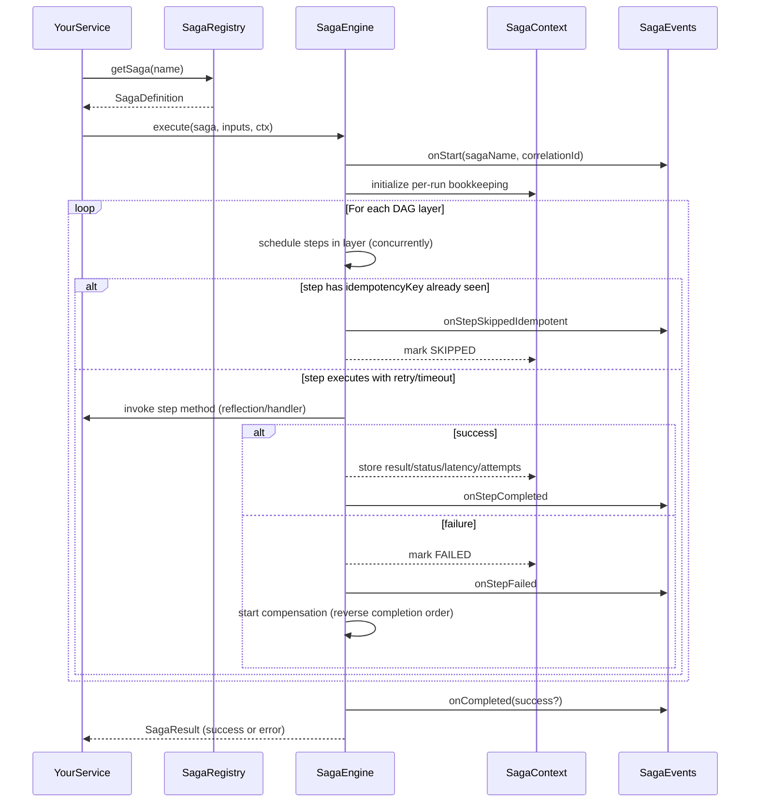
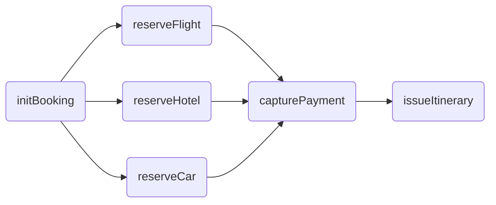
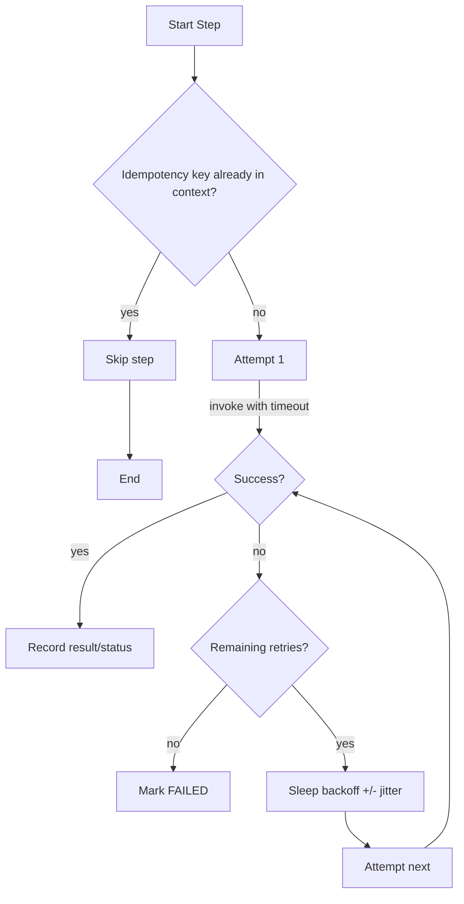
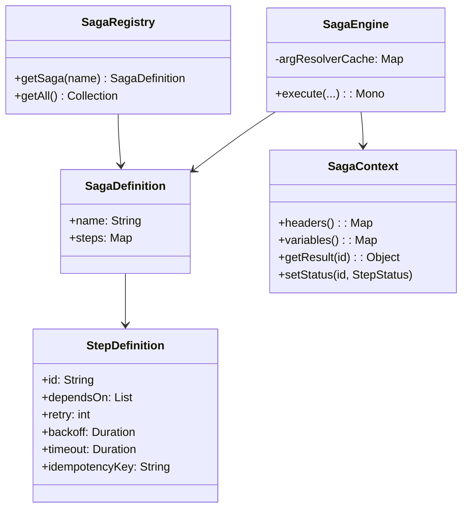

# Transactional Engine — Architecture, Design Decisions, and Performance Guide

This document explains how the in-memory saga orchestration library is built and why we made certain decisions. It includes visual diagrams and practical guidance so you can understand, extend, and operate it effectively.

If you are new to the library, start with README.md for a quick overview, then come back here for the deeper internals. For a hands-on, end-to-end walkthrough, see docs/TUTORIAL.md.

## Table of contents
- Goals and constraints
- Architectural overview (with diagrams)
- How execution works (step-by-step)
- Key design decisions
- Performance and memory techniques
- Configuration knobs and trade-offs
- Memory footprint considerations
- Future extensions (non-goals)

## Goals and constraints
- In-memory orchestration: a single-JVM library with no persistence of saga state.
- Deterministic orchestration semantics: DAG of steps with compensation on failure.
- Developer ergonomics: annotation-based steps, parameter injection, and a typed API.
- Operational safety: timeouts, retries with backoff and optional jitter, per-run idempotency.

## Architectural overview

High-level components and their responsibilities:

- SagaRegistry: discovers `@Saga` beans and their `@SagaStep` methods, builds `SagaDefinition`/`StepDefinition`, validates DAG, resolves proxy-safe invocation methods.
- SagaEngine: executes the DAG layer-by-layer with concurrency, retries/backoff, and timeouts; stores results/metrics in `SagaContext`; compensates on failure; emits `SagaEvents`.
- SagaContext: per-execution, in-memory container for headers, variables, step statuses, results, attempts, and latencies.
- SagaEvents: pluggable observability sink; default logger-based sink is provided, with optional tracing/metrics integration.
- HttpCall: helper for propagating headers (like correlation id) on outbound HTTP calls.

## How execution works

From discovery to a completed (or compensated) run:

DAG layering (topological ordering) — steps in the same layer run concurrently:

Retry/backoff/timeout flow for a single step:

Compensation order is the reverse of the actual completion order of successful steps. With policy GROUPED_PARALLEL, compensations may run in parallel within the same original layer to speed up rollbacks.

## Key design decisions

At a glance
- In-memory, single-JVM orchestrator for simplicity and speed; no persisted state. Intended for short-lived, in-process workflows.
- Deterministic execution over a DAG; compensation in reverse completion order.
- Annotation-first API with programmatic escape hatches when you need dynamic flows or test doubles.

Execution semantics (deterministic by design)
- DAG-first: compute topological layers; execute one layer at a time; steps within a layer run concurrently.
- Failure model: on first failure, stop scheduling new layers and compensate successful steps in reverse completion order. Optional grouped-parallel compensation speeds large rollbacks.

API & extensibility
- Convenience: @Saga + @SagaStep with parameter injection for clean signatures.
- Control: programmatic builder (SagaBuilder), StepHandler, and typed StepInputs bypass reflection on the hot path.
- Proxy-safe: registry resolves invocation methods on the actual Spring bean so AOP (@Transactional, aspects) remains effective.

Resilience & safety
- Per-step knobs (opt-in): retry with fixed/jittered backoff, per-attempt timeout, cpuBound scheduling hint, and per-run idempotency via idempotencyKey.
- Parameter injection rules (strict): exactly one implicit, unannotated non-SagaContext parameter (the step input) is allowed; everything else should be annotated (@FromStep, @Header, @Headers, @Variable, @Variables, @Input). Misconfigurations fail fast.
- Idempotency scope: per run only; not a cross-run dedup store. Design downstream APIs to be naturally idempotent.

Observability & defaults
- Events: minimal logger-based SagaEvents out of the box; plug in metrics/tracing if present.
- Conservative defaults: backoff 100ms, timeout disabled (Duration.ZERO), unbounded per-layer concurrency unless capped via @Saga.layerConcurrency.

## Performance and memory techniques

Defaults (short and sane)
- Backoff: 100ms fixed (jitter optional). Timeout: disabled (Duration.ZERO). Layer concurrency: unbounded unless capped via @Saga.

Golden rules
- Keep steps non-blocking; if blocking is unavoidable, isolate it and mark cpuBound.
- Prefer a couple of fast retries over one long timeout.
- Keep payloads/results small; store only what you need in SagaContext.

1) Reflection/annotation caching (hot path)
- Arg resolvers compiled once per method and cached (ConcurrentHashMap). No repeated annotation scans.
- Tip: Prefer parameter annotations to manual context plumbing—clearer and free at runtime thanks to caching.
- Diagnostics: misconfigurations raise clear IllegalStateException on first use/startup.

2) One-time registry scan (proxy-safe)
- Single startup pass builds SagaDefinition/StepDefinition; resolves proxy-safe invocation methods against actual bean classes.
- Complexity ~ O(number of step/compensation methods). No steady-state scanning cost.

3) Minimal allocations on the hot path
- Per-run state in SagaContext uses concurrent maps/sets; read-only views avoid copying.
- StepInputs supports lazy resolvers evaluated just-in-time and reused for compensation.

4) Concurrency & scheduling
- Concurrent execution within a layer; cap with @Saga.layerConcurrency to protect CPU/memory and downstreams.
- cpuBound=true runs on Reactor parallel; I/O steps remain on I/O-appropriate schedulers.
- Avoid blocking inside steps; if needed, use a dedicated scheduler or handler to avoid starving pools.

5) Retries/backoff/jitter
- Fixed backoff by default; optional jitter/jitterFactor de-correlates waves of retries.
- Implementation uses ThreadLocalRandom to jitter around base backoff.
- Typical values: retry 1–3, backoff 100–500ms.

6) Per-attempt timeouts
- Bound each attempt to prevent hangs and wasted resources. Keep aligned with downstream SLAs.

7) Per-run idempotency
- idempotencyKey marks a step before execution; repeated keys within the same run are skipped (onStepSkippedIdempotent).
- Scope is intra-run only; not a durable dedup mechanism.

8) Thread-safe bookkeeping
- All SagaContext structures are concurrent to safely handle many steps running in the same layer.

9) Small, bounded surfaces
- Caches scale with code surface (@SagaStep count). SagaContext is per-execution and GC-eligible when complete.

Quick tuning checklist
- Cap fan-out layers (layerConcurrency) when downstreams are sensitive.
- Add jitter where many steps call the same downstream under load.
- Prefer more layers (shallower concurrency) over huge single layers when memory is tight.
- Keep objects small; store identifiers instead of large payloads when possible.

Diagnostics quick guide
- Check attempts/latencyMs in events to spot retries/timeouts quickly.
- Wire Micrometer/Tracing for timers/spans; look for scheduler contention and queueing.
- Slow rollbacks? Try GROUPED_PARALLEL and ensure compensations are idempotent and fast.

## Memory footprint considerations
- Caches (registry and argument resolvers) are unbounded but naturally sized by the number of discovered methods. Typical apps stabilize after startup.
- Per-execution `SagaContext` is created at the start of `execute/run` and becomes eligible for GC when the Mono completes and references are dropped.
- Step results are only stored if non-null; prefer lightweight DTOs for large payloads.

## Configuration knobs and trade-offs
- `layerConcurrency` (on `@Saga`): limit concurrent steps within a layer to control CPU/memory pressure.
- `retry/backoff/jitter/jitterFactor`: trade latency for resilience; jitter helps de-correlate retries under load.
- `timeout`: set per-step timeouts to bound latency; `0` disables.
- `cpuBound`: set to true for CPU-intensive work to keep I/O schedulers free.

## Class relationships (simplified)

## Future extensions (non-goals today)
- Persistent state store and resume/retry after process restarts.
- Pluggable schedulers/pools per step.
- Bounded caches with eviction policies for extremely large applications.

Tip: For a complete, runnable example that uses these concepts, see docs/TUTORIAL.md.

