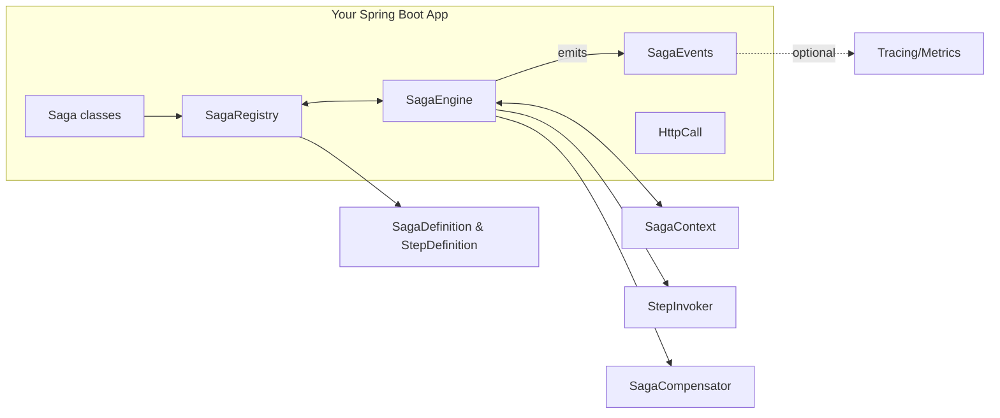
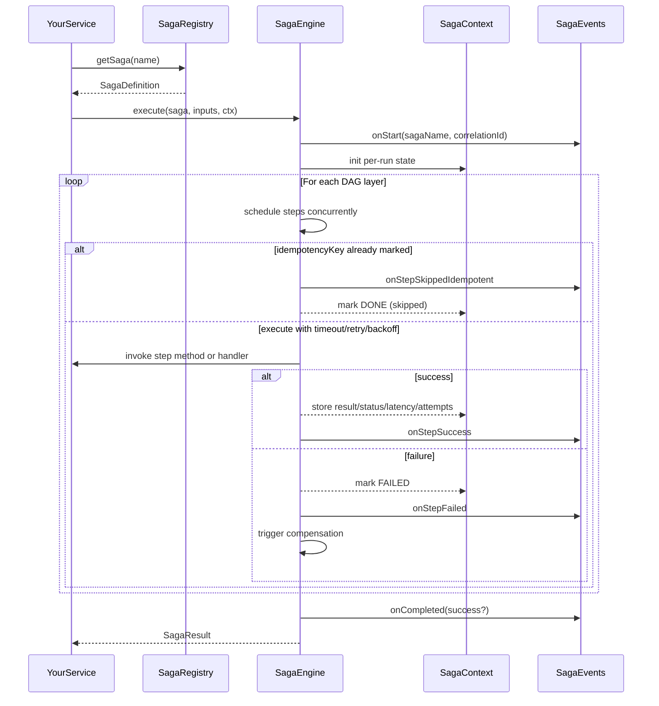
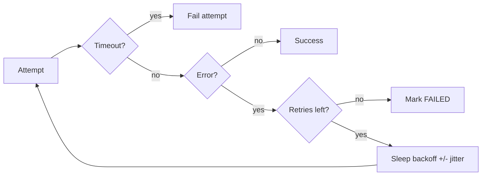
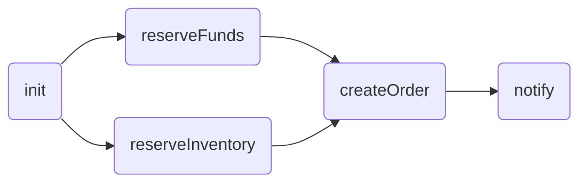
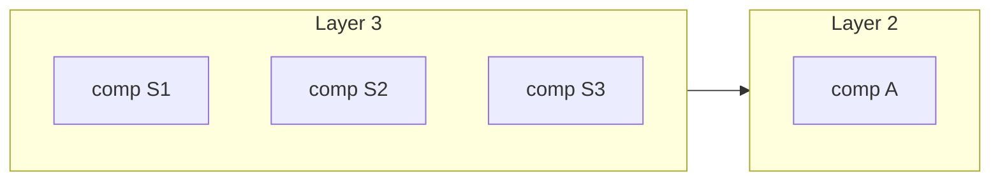
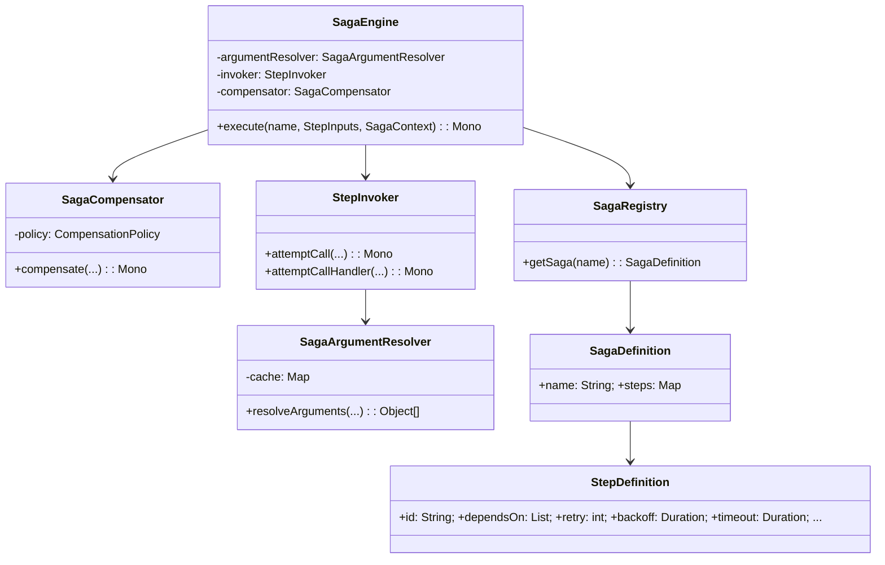

# Deep Dive into the Transactional Engine (Saga Orchestrator)

This document provides an in-depth tour of the engine’s internals, design trade‑offs, and advanced usage. It complements the high‑level [README](../README.md) and [ARCHITECTURE](./ARCHITECTURE.md) documents with more detailed diagrams and practical guidance.

If you’re looking for a hands‑on walkthrough, start with the [Tutorial](./TUTORIAL.md). For API references and snippets, see the [Reference Card](./REFERENCE_CARD.md).

---

## Goals of the engine
- In-memory orchestration of short‑lived, multi-step workflows.
- Deterministic DAG execution with clear compensation semantics.
- Minimal ceremony for developers: annotations, parameter injection, typed inputs/results.
- Operational safety: retry/backoff/timeout, optional jitter, and per‑run idempotency.

What it is not
- Not a durable workflow engine; there’s no built‑in persistence or resume after process restarts.
- Not a distributed transaction manager; use it for orchestrating service calls with compensations, not ACID.

---

## Components and responsibilities



- SagaRegistry: Discovers and validates the DAG from `@Saga`/`@SagaStep`, handles `@ExternalSagaStep` and `@CompensationSagaStep`, resolves proxy‑safe invocation methods, and builds `SagaDefinition`/`StepDefinition`.
- SagaEngine: Orchestrates execution by topological layers. Applies retry/backoff/timeout/idempotency, records outcomes in `SagaContext`, and emits `SagaEvents`. On failure, triggers compensation.
- StepInvoker: Encapsulates invocation and resilience (timeout, retry with jitter). It also resolves method arguments via `SagaArgumentResolver`.
- SagaCompensator: Coordinates rollback flows according to a `CompensationPolicy`.
- SagaContext: Per‑run, in‑memory state: correlation id, outbound headers, variables, per‑step results/status/attempts/latency, compensation results/errors.
- HttpCall: Helper for propagating headers/correlation id into WebClient and mapping non‑2xx error bodies to exceptions.

---

## Execution flow (happy and failure paths)



Retry/backoff/timeout on each attempt:



---

## DAG layering and concurrency

The registry computes a topological order and groups steps into layers; steps within a layer run concurrently. Use `@Saga(layerConcurrency = N)` to limit concurrency if downstream services are sensitive to fan‑out.



---

## Compensation policies and flows

You can choose how the engine performs rollbacks via `SagaEngine.CompensationPolicy`:
- STRICT_SEQUENTIAL (default): one by one, reverse completion order.
- GROUPED_PARALLEL: compensate by original layers; independent compensations run in parallel within a batch.
- RETRY_WITH_BACKOFF: sequential rollback; each compensation gets timeout/retry/backoff.
- CIRCUIT_BREAKER: sequential rollback; opens a circuit (skips remaining) if a compensation marked as critical fails.
- BEST_EFFORT_PARALLEL: run all compensations in parallel; record errors without stopping others.

Grouped-parallel (visual):



Per-step compensation overrides
- `compensationRetry`, `compensationBackoffMs`, `compensationTimeoutMs`, `compensationCritical`.
- These are applied by the compensator regardless of step‑level deprecations (see below).

---

## Argument resolution (method parameters)

The engine resolves parameters for step and compensation methods using annotations and types:
- `@Input` or `@Input("key")`: the current step input from `StepInputs` (direct value or key from a Map).
- `@FromStep("stepId")`: inject result of another step.
- `@FromCompensationResult("stepId")`: inject the value produced by a compensation for the given step id.
- `@CompensationError("stepId")`: inject the Throwable captured from a compensation for the given step id (may be null if that compensation did not run or succeeded).
- `@Header("X-Name")` / `@Headers`: outbound headers.
- `@Variable("k")` / `@Variables`: variables map.
- `SagaContext`: injected by type.
- `@Required` on a parameter enforces non-null after resolution; otherwise the engine throws an `IllegalStateException` at invocation time.
- `@SetVariable("k")` on a step method stores its return value into variables.

If there’s exactly one unannotated parameter (and it isn’t SagaContext), it’s treated as the step input (implicit). Misconfigurations fail fast with a clear message.

Compensation argument rule:
- If the first parameter type matches the original input, the engine passes input.
- Else if it matches the step result type, the engine passes result.
- Else, `null` is passed for the business argument (SagaContext can still be injected).

---

## StepInputs and ExpandEach (fan‑out at runtime)

Use `StepInputs` to supply inputs per step id or via method references. For fan‑out, provide `ExpandEach.of(list[, suffixFn])` as the input to a step; the engine clones the step once per item and rewires dependencies.

Example:
```java
StepInputs inputs = StepInputs.builder()
  .forStep(OrderSaga::createOrder, new CreateOrderCmd("cust-123", "SKU-1", 2, 500_00))
  .forStep(OrderSaga::sendNotification, ExpandEach.of(recipients, it -> ((Recipient) it).value()))
  .build();
```

What happens:
- Step `sendNotification` is cloned per recipient with ids like `sendNotification#0..#N` or with custom suffix.
- Dependents of `sendNotification` are rewired to depend on all clones.
- On failure, already completed clones are compensated individually before upstream rollbacks.

---

## Resilience configuration and deprecations

Preferred configuration for new code
- Use `SagaBuilder` (programmatic) to set `Duration`‑based values: `.retry(int)`, `.backoff(Duration)`, `.timeout(Duration)`, `.jitter(boolean)`, `.jitterFactor(double)`. The DSL also offers ms‑based overloads when convenient: `.backoffMs(long)`, `.timeoutMs(long)`.

Deprecated step‑level annotation fields
- `backoffMs` and `timeoutMs` on `@SagaStep`/`@ExternalSagaStep` are deprecated in annotations only. They remain readable for legacy code paths but should not be used in new code or examples. In the DSL, `backoffMs` and `timeoutMs` are supported and not deprecated.
- Compensation overrides (`compensationRetry`, `compensationBackoffMs`, `compensationTimeoutMs`, `compensationCritical`) remain supported.

---

## Observability and reporting
- `SagaEvents` provides a lifecycle API; default implementation logs structured events. You can implement a custom sink to export metrics/spans.
- `SagaResult` returns per‑step outcomes including `compensationResult` and `compensationError`.
- `SagaReport` adds ergonomic accessors (failed/compensated steps, per‑step compensation details).

---

## Best practices
- Model clear, idempotent compensations; design downstream APIs to be safe to call multiple times.
- Keep step methods non‑blocking; use timeouts on remote calls; cap per‑layer concurrency where needed.
- Prefer typed DTOs; avoid raw maps.
- Use `HttpCall.propagate` to forward correlation/user headers.
- Consider `GROUPED_PARALLEL` rollback only when compensations are independent and idempotent.

---

## Migration notes (from deprecated APIs)
- Replace any usage of `SagaEngine.run(...)` with `SagaEngine.execute(...)`, returning `SagaResult`.
- Replace ms‑based step configuration in annotations (`backoffMs`, `timeoutMs`) with programmatic `SagaBuilder` Duration methods.
- Keep compensation overrides when needed; they remain supported.
- Prefer programmatic `StepHandler` + `SagaBuilder` for dynamic workflows and test doubles; method references keep @SetVariable working.

---

## Appendix: Class relationships (detailed)



---

Last updated: 2025-08-21
