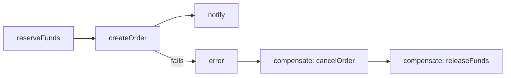
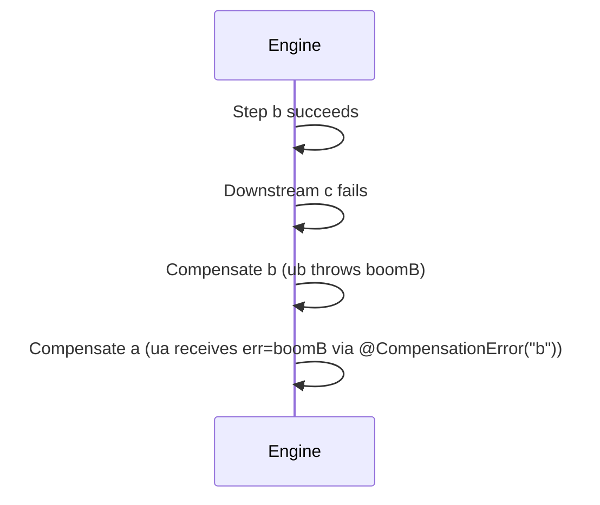
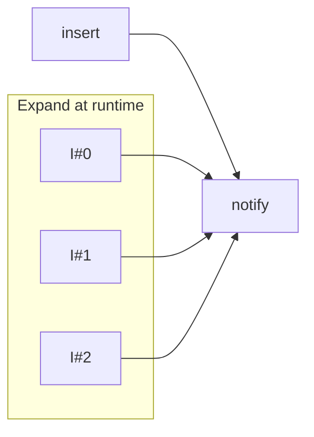

# Transactional Engine — DSL Guide, Rationale, and Best Practices

Audience: Spring developers building short‑lived, multi‑service orchestrations. You prefer declarative code with clear rollback behavior and operational safety.

Prerequisites: Basic knowledge of Spring, Reactor (Mono), and the Saga pattern.

---

Table of contents
- [What is the DSL (and why it exists)](#what-is-the-dsl--and-why-it-exists-architecture-decisions)
- [When to use the DSL / When to choose the programmatic builder](#when-to-use-the-dsl)
- [Quick start pointers (where to learn each topic)](#quick-start-pointers)
- [Mental model (how to think in steps, dependencies, and compensations)](#mental-model-think-in-steps-and-compensations)
- [Parameter injection (deep dive with examples and validation rules)](#parameter-injection-deep-dive)
- [Compensation behavior (data passing rules, cross-compensation data)](#compensation-behavior-data-passing--cross-compensation)
- [Patterns that work well (external steps, external compensations, ExpandEach)](#patterns-that-work-well-with-the-dsl)
- [Observability and operations](#observability-and-operations)
- [Performance and safety tips](#performance-and-safety-tips)
- [Migration and compatibility notes](#migration-and-compatibility-notes)
- [FAQ](#faq)
- [Glossary](#glossary)
- [References](#references)

---

## What is the DSL — and why it exists (architecture decisions)

This library offers two complementary ways to build orchestrations: an annotation‑based DSL and a programmatic builder. The DSL exists to make common workflows fast to write, easy to read, and safe by default.

Architecture decision (ADR‑style)
- Decision: Provide an annotation‑based DSL for declaring saga steps and compensations on Spring beans.
- Status: Accepted, with programmatic builder kept for dynamic graphs and tests.
- Context:
  - We observed recurring workflow shapes: a handful of external calls, explicit dependencies, and clear compensations.
  - Teams wanted minimal ceremony, clean method signatures (without manual context plumbing), and startup validation.
  - We also wanted predictable, in‑process behavior without running an external workflow server.
- Alternatives considered:
  - Programmatic builder only: very flexible, but noisier and slower to adopt for simple workflows.
  - External workflow engines: powerful but heavy to operate; persistence and out‑of‑process scheduling are not goals here.
- Consequences:
  - The DSL is optimized for static or moderately static DAGs.
  - Parameter injection + validation provide safety and clarity; reflection overhead is mitigated by resolver caching.
  - The programmatic surface remains to cover highly dynamic graphs and advanced testing scenarios.

Design choices backed by code
- Proxy‑safe invocation: The registry resolves the actual invocation method on the Spring proxy so aspects/@Transactional keep working.
- Fail‑fast validation: The registry validates the DAG (no cycles, deps exist) and parameters (annotation/type sanity) at startup.
- Argument resolver caching: Parameter resolver functions are compiled once per method and cached (ConcurrentHashMap) for runtime efficiency.
- Deterministic compensation: On first failure, schedule compensations for already completed steps according to policy (default: strict sequential).

---

## When to use the DSL

Use the annotation‑based DSL when:
- Your workflow is reasonably static and fits a clear DAG of steps with explicit compensations.
- You want concise, declarative code embedded in a Spring bean.
- You prefer parameter injection to manual context lookups.
- You want startup validation and guardrails.

Prefer the programmatic builder when:
- The graph is highly dynamic (conditional edges, data‑driven fan‑out beyond ExpandEach, runtime branching).
- You construct sagas in tests or modules that shouldn’t depend on Spring annotations.
- You want Duration‑based knobs everywhere (builder is more expressive for resilience tuning).

Not a good fit for the DSL (and engine itself):
- Long‑running, durable workflows that must survive restarts (no persistence here).
- Exactly‑once semantics across services (design idempotent interfaces instead).

---

## Quick start pointers
- Hands‑on tutorial: TUTORIAL.md
- API cheatsheet: REFERENCE_CARD.md
- How it works (internals): ARCHITECTURE.md and DEEP_DIVE_INTO_THE_ENGINE.md
- Dynamic graphs (no annotations): PROGRAMMATIC_QUICK_GUIDE.md

---

## Mental model (think in steps and compensations)

- A step is one business action with a clear inverse (compensation).
- Keep the DAG explicit and acyclic: express prerequisites with `dependsOn`.
- On first failure, stop scheduling new layers and compensate successfully completed steps according to policy.
- The engine records results, status, attempts, latency, and later compensation results/errors in SagaContext; SagaResult returns a read‑only snapshot.

Small visual


---

## Parameter injection (deep dive)

Supported annotations and types
- `@Input` or `@Input("key")` — current step input from StepInputs (value or map key)
- `@FromStep("stepId")` — result of another step
- `@FromCompensationResult("stepId")` — value produced by a compensation of the referenced step id (after rollback)
- `@CompensationError("stepId")` — Throwable captured from a compensation for the referenced step id
- `@Header("X-Name")` / `@Headers Map<String,String>` — outbound headers
- `@Variable("k")` / `@Variables Map<String,Object>` — variables map
- `SagaContext` — always injectable by type
- `@Required` (parameter‑level) — fail fast when the resolved value is null (e.g., missing header)
- `@SetVariable("k")` (method‑level) — store the method return value into variables under key `k`

Validation rules and messages
- Exactly one implicit, unannotated non‑SagaContext parameter is allowed per method (treated as step input). Adding more causes a validation error.
- `@CompensationError` parameter type must be assignable to `Throwable`.
- When a `@FromStep("id")` reference is unknown, startup validation fails with a clear error.
- `@Required` throws at invocation time if the resolved value is null (e.g., a missing header): IllegalStateException with parameter name and method.

Examples
```java
@SagaStep(id = "createOrder", compensate = "cancelOrder", dependsOn = {"reserveFunds"})
@SetVariable("orderId")
Mono<Long> createOrder(
  @Input CreateOrderCmd cmd,
  @Header("X-User-Id") @Required String user,
  @FromStep("reserveFunds") String fundsRes,
  SagaContext ctx
) { /* ... */ }

Mono<Void> cancelOrder(@Input CreateOrderCmd cmd, SagaContext ctx) { /* inverse */ }
```

Common mistake and fix
- Mistake: two unannotated parameters -> Fix: mark one as `@Input`, add `SagaContext` explicitly if needed.
- Mistake: expecting a header that may be absent -> Fix: add `@Required` (or handle nulls defensively).

---

## Compensation behavior (data passing + cross‑compensation)

Automatic business argument rule (by type)
- If the first compensation parameter type matches the original step input, the engine passes the input.
- Otherwise, if it matches the step result type, the engine passes the result.
- Otherwise, the business argument is null. `SagaContext` can always be injected by type.

Cross‑compensation data (new)
- `@FromCompensationResult("b")` injects the value returned by compensation of step `b`.
- `@CompensationError("b")` injects the Throwable thrown by the compensation of step `b` (or null if not run/no error).

Example
```java
@SagaStep(id = "a", compensate = "ua")
Mono<String> a() { return Mono.just("A"); }
Mono<Void> ua(@CompensationError("b") Throwable err, SagaContext ctx) {
  if (err != null) ctx.putVariable("compErrB", err.getMessage());
  return Mono.empty();
}

@SagaStep(id = "b", compensate = "ub", dependsOn = {"a"})
Mono<String> b(@Required @Header("X-User") String user) { return Mono.just("B:" + user); }
Mono<Void> ub(String res) { return Mono.error(new RuntimeException("boomB")); }
```

Rollback visualization


---

## Patterns that work well with the DSL

1) External steps and compensations
- `@ExternalSagaStep` declares a step on any Spring bean and links it to a saga by name.
- `@CompensationSagaStep` declares a compensation outside the orchestrator; it overrides in‑class compensation when both exist.

2) Fan‑out at runtime with ExpandEach
- When a step processes a list, avoid loops inside the step. Provide `ExpandEach.of(list[, suffixFn])` as the step input. The engine clones the step once per item, rewires dependents, and each clone inherits the original compensation.

Visual


3) Observability by default
- Default `SagaLoggerEvents` emits structured logs. Optional Micrometer/Tracing beans are auto‑wired when present.
- `StepLoggingAspect` adds method boundary logs; toggle with `transactionalengine.step-logging.enabled=true|false` (default true).

---

## Observability and operations
- Correlate via `SagaContext.correlationId()`; `HttpCall` propagates it as `X-Transactional-Id`.
- Inspect runs via `SagaResult` (step outcomes, compensation result/error); `SagaReport` provides ergonomic accessors.
- Compensation events (new): `onCompensationStarted`, `onCompensationRetry`, `onCompensationSkipped`, `onCompensationCircuitOpen`, `onCompensationBatchCompleted`, `onCompensated`.

---

## Performance and safety tips
- Keep steps non‑blocking; mark CPU‑heavy work with `cpuBound=true` to avoid starving I/O.
- Always set timeouts on remote calls; prefer a couple of quick retries with modest backoff and optional jitter.
- Use `idempotencyKey` for per‑run idempotency; design downstream APIs to be idempotent across runs.
- Store only what you need in variables; prefer identifiers over large payloads.

---

## Migration and compatibility notes
- From older code that manually passed data via `SagaContext`: replace boilerplate with parameter annotations.
- From programmatic builder to DSL: keep handlers while migrating gradually; method references work with StepInputs and preserve @SetVariable.
- Validation got stricter: multiple unannotated parameters or wrong `@CompensationError` types fail fast.

---

## FAQ
- Does the engine persist state? No — it is in‑memory and intended for short‑lived orchestrations.
- Can I mix DSL and programmatic steps? Yes. External steps and programmatic handlers interoperate; choose per use case.
- How do I pass values between compensations? Use `@FromCompensationResult`/`@CompensationError` targeting the desired step id.
- What runs in compensations if a step never completed? Only completed steps are compensated; others are not.

---

## Glossary
- Saga: Orchestrator class annotated with `@Saga(name=...)`.
- Step: Unit of work annotated with `@SagaStep`; may declare `dependsOn` and `compensate`.
- Compensation: Inverse action executed during rollback; declared in‑class or via `@CompensationSagaStep`.
- SagaContext: Per‑run state (headers, variables, attempts, status, results, compensation results/errors).
- SagaResult: Immutable summary of a run with per‑step outcomes.

---

## References
- Tutorial: TUTORIAL.md
- Reference Card: REFERENCE_CARD.md
- Architecture: ARCHITECTURE.md
- Deep Dive: DEEP_DIVE_INTO_THE_ENGINE.md
- Programmatic builder: PROGRAMMATIC_QUICK_GUIDE.md

Last updated: 2025‑08‑22


---

## Step events (optional)
You can ask the engine to publish one event per step when the saga completes successfully (no compensations were executed), by annotating steps with `@StepEvent`.

Quick example:

```java
@SagaStep(id = "charge")
@StepEvent(topic = "billing.events", type = "PAYMENT_CHARGED")
public Mono<Receipt> charge(@Input Payment p) { return reactor.core.publisher.Mono.empty(); }
```

Key points:
- Events are emitted only after the saga finishes and only if it succeeded.
- One event per annotated step, in completion order.
- The payload is the step result; headers are copied from `SagaContext.headers()`.
- By default, events are published as Spring ApplicationEvents (in‑process). Provide your own `StepEventPublisher` bean to publish to Kafka/SQS/etc.

See the dedicated guide for details and adapter examples: docs/StepEvents.md
