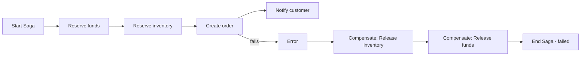
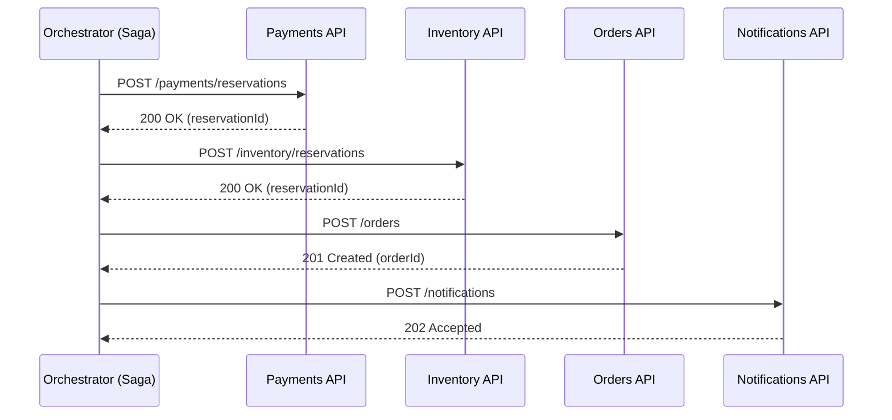

# Transactional Engine — Step‑by‑Step Tutorial (Real‑World Example)

Welcome! This tutorial will guide you through a real‑world implementation of the Transactional Engine (Saga Orchestrator) in a Spring Boot 3 project. We will build an Order workflow that coordinates multiple services: Payments, Inventory, and Shipping. You will learn by baby steps, with diagrams, code, and best practices.

If you’re already familiar with the library, you can jump to the sections you need. Otherwise, follow the sequence — each step builds on the previous one.

Contents
- What we’re building (overview and diagrams)
- Project setup (dependencies)
- Bootstrapping the engine
- Modeling the Order Saga
- Declaring steps and compensations
- Passing data across steps (parameter injection)
- Calling external services (HttpCall + WebClient)
- Executing the saga programmatically
- Resilience: retry, backoff, timeout, idempotency
- Compensation policies
- Observability and logging
- Production checklist and best practices

---

## 1) What we’re building

We will orchestrate a simple but realistic Order flow:
1. Reserve funds in the Payments service
2. Reserve items in the Inventory service
3. Create the Order in the Orders service
4. Notify the customer via the Notifications service

If any step fails, previously completed steps are compensated in reverse order (e.g., release funds and release inventory).

High‑level flow (with failure path):



Sequence view when all goes well:



---

## 2) Project setup (dependencies)

Maven (example coordinates — adjust version/group to your publishing setup):

```xml
<dependency>
  <groupId>com.catalis</groupId>
  <artifactId>lib-transactional-engine</artifactId>
  <version>1.0.0-SNAPSHOT</version>
</dependency>
```

Gradle (Kotlin DSL):

```kotlin
dependencies {
  implementation("com.catalis:lib-transactional-engine:1.0.0-SNAPSHOT")
}
```

This tutorial uses Spring WebFlux’s WebClient for HTTP calls.

---

## 3) Bootstrapping the engine

Enable the engine with one annotation. This registers the SagaRegistry, SagaEngine, default SagaEvents, and an optional StepLoggingAspect.

```java
import com.catalis.transactionalengine.annotations.EnableTransactionalEngine;
import org.springframework.context.annotation.Configuration;

@Configuration
@EnableTransactionalEngine
public class TxnEngineConfig {
}
```

Tip: The engine is in‑memory (no persistence). It’s ideal for short‑lived orchestrations within a single process.

---

## 4) Modeling the Order Saga

We’ll create an orchestrator class annotated with @Saga. You can control layer concurrency if you have independent steps that can run in parallel.

```java
import com.catalis.transactionalengine.annotations.Saga;

@Saga(name = "OrderSaga", layerConcurrency = 0) // 0 = unbounded per layer
public class OrderSagaOrchestrator {
  // Step methods will be added in the next section
}
```

Step IDs must be unique across the saga. Dependencies define a DAG (no cycles).

---

## 5) Declaring steps and compensations

Each step is a method annotated with @SagaStep. Compensation can be declared in‑class via the `compensate` attribute or externally with @CompensationSagaStep.

```java
import com.catalis.transactionalengine.annotations.SagaStep;
import com.catalis.transactionalengine.core.SagaContext;
import reactor.core.publisher.Mono;

public class OrderSagaOrchestrator {

  // 5.1 Reserve funds (with compensation)
  @SagaStep(id = "reserveFunds", compensate = "releaseFunds", retry = 2, backoffMs = 200, timeoutMs = 3_000)
  public Mono<String> reserveFunds(ReserveFundsCmd cmd, SagaContext ctx) {
    // Implemented in section 7 with HttpCall
    return Mono.just("funds-reservation-123");
  }

  public Mono<Void> releaseFunds(ReserveFundsCmd cmd, SagaContext ctx) {
    // Implemented in section 7
    return Mono.empty();
  }

  // 5.2 Reserve inventory (depends on funds)
  @SagaStep(id = "reserveInventory", compensate = "releaseInventory", dependsOn = {"reserveFunds"}, retry = 2)
  public Mono<String> reserveInventory(ReserveInventoryCmd cmd, SagaContext ctx) {
    return Mono.just("inventory-reservation-456");
  }

  public Mono<Void> releaseInventory(ReserveInventoryCmd cmd, SagaContext ctx) {
    return Mono.empty();
  }

  // 5.3 Create order (depends on previous two)
  @SagaStep(id = "createOrder", compensate = "cancelOrder", dependsOn = {"reserveFunds", "reserveInventory"}, timeoutMs = 2_000)
  public Mono<Long> createOrder(CreateOrderCmd cmd, SagaContext ctx) {
    return Mono.just(42L);
  }

  public Mono<Void> cancelOrder(CreateOrderCmd cmd, SagaContext ctx) {
    return Mono.empty();
  }

  // 5.4 Notify (depends on order)
  @SagaStep(id = "notifyCustomer", compensate = "", dependsOn = {"createOrder"})
  public Mono<Void> notifyCustomer(NotifyCmd cmd, SagaContext ctx) {
    return Mono.empty();
  }
}
```

Notes:
- Return type can be `Mono<T>` (preferred) or a plain `T` (wrapped automatically).
- `retry`, `backoffMs`, `timeoutMs` are convenient annotation attributes. For complex configs, prefer the programmatic builder (see Reference Card) or inject them via external config.
- `idempotencyKey` can be used to skip a step within the same run.

External step example (@ExternalSagaStep) — place steps in any Spring bean and link them to the saga by name:

```java
import com.catalis.transactionalengine.annotations.ExternalSagaStep;
import com.catalis.transactionalengine.core.SagaContext;
import org.springframework.stereotype.Component;
import reactor.core.publisher.Mono;

@Component
public class ExternalOrderSteps {
  @ExternalSagaStep(saga = "OrderSaga", id = "auditLog")
  public Mono<Void> auditLog(SagaContext ctx) {
    // Persist an audit entry; runs when configured in DAG
    return Mono.empty();
  }
}
```

---

## 6) Passing data across steps (parameter injection)

Avoid manual context plumbing. Use annotations to inject inputs, previous results, headers, or variables directly into method parameters.

Supported annotations and types:
- `@Input` or `@Input("key")` — current step input (from StepInputs)
- `@FromStep("stepId")` — result of another step
- `@Header("X-Name")` / `@Headers Map<String,String>` — outbound headers
- `@Variable("k")` / `@Variables Map<String,Object>` — variables map
- `SagaContext` — injected by type
- `@SetVariable("k")` — store the method return value into context variables

Note on compensation parameter mapping:
- If a compensation method’s first parameter type matches the original step input, the engine passes the input.
- Otherwise, if it matches the step result, the engine passes the result.
- Otherwise, the business argument is null. Add `SagaContext` as needed and you may also use `@Input`, `@FromStep`, `@Header/@Headers`, and `@Variable/@Variables` on compensations.

Example mixing injection:

```java
import com.catalis.transactionalengine.annotations.*;

@Saga(name = "OrderSaga")
public class OrderSagaOrchestrator {
  @SagaStep(id = "createOrder", compensate = "cancelOrder", dependsOn = {"reserveFunds", "reserveInventory"})
  @SetVariable("orderId")
  public Mono<Long> createOrder(
      @Input CreateOrderCmd cmd,
      @FromStep("reserveFunds") String fundsReservationId,
      @FromStep("reserveInventory") String inventoryReservationId,
      SagaContext ctx
  ) {
    // Build request using inputs and prior results; store orderId via @SetVariable
    return Mono.just(101L);
  }
}
```

---

### 6.1) Passing data to compensations

Compensations receive data automatically based on parameter types. The engine chooses which business argument to pass using this order:
- If the first parameter type matches the original step input, it passes the input.
- Otherwise, if it matches the step result, it passes the result.
- Otherwise, the business argument is null. You can always declare `SagaContext` and it will be injected by type.

You can also use parameter annotations on compensation methods for explicit injection: `@Input`, `@FromStep`, `@Header/@Headers`, `@Variable/@Variables`.

Examples

1) Compensation receives step result
```java
@SagaStep(id = "a", compensate = "undoA")
Mono<String> a(SagaContext ctx) { return Mono.just("A"); }

// First parameter type (String) matches step result → engine passes result
Mono<Void> undoA(String result, SagaContext ctx) { return Mono.empty(); }
```

2) Compensation receives original input
```java
record PaymentReq(String customerId, long amountCents) {}

@SagaStep(id = "pay", compensate = "undoPay")
Mono<Receipt> pay(@Input PaymentReq req, SagaContext ctx) { /* call downstream */ }

// First parameter type matches step input → engine passes input
Mono<Void> undoPay(PaymentReq req, SagaContext ctx) { /* refund */ }
```

3) Context-only compensation
```java
@SagaStep(id = "x", compensate = "undoX")
Mono<Void> x(SagaContext ctx) { return Mono.empty(); }

// No business argument; only context
Mono<Void> undoX(SagaContext ctx) { return Mono.empty(); }
```

4) External compensation mapping
```java
@Component
class ExternalComps {
  @CompensationSagaStep(saga = "OrderSaga", forStepId = "createOrder")
  Mono<Void> cancelOrderExternal(@FromStep("createOrder") Long orderId, SagaContext ctx) {
    // or declare (CreateOrderCmd cmd, SagaContext ctx) if you prefer the original input
    return Mono.empty();
  }
}
```

Tip: If the first compensation parameter does not match input or result, it will be null. In that case, use explicit annotations or adjust the type.

---

## 7) Calling external services (HttpCall + WebClient)

Use `HttpCall` to propagate the saga correlation id (`X-Transactional-Id`) and any custom headers. You can also map error bodies to exceptions to fail steps cleanly.

DTOs and exception:

```java
record ReserveFundsCmd(String customerId, long amountCents) {}
record ReserveInventoryCmd(String sku, int quantity) {}
record CreateOrderCmd(String customerId, String sku, int quantity, long amountCents) {}
record NotifyCmd(String customerId, long orderId) {}

record PaymentReservationResponse(String reservationId) {}
record PaymentError(String code, String message) {}

class PaymentDownstreamException extends RuntimeException {
  final int status;
  final String code;
  PaymentDownstreamException(int status, String code, String msg) {
    super("Payments error [" + status + "] " + code + ": " + msg);
    this.status = status; this.code = code;
  }
}
```

Configure WebClient and implement steps:

```java
import com.catalis.transactionalengine.http.HttpCall;
import org.springframework.beans.factory.annotation.Value;
import org.springframework.stereotype.Service;
import org.springframework.web.reactive.function.client.WebClient;
import reactor.core.publisher.Mono;

@Service
public class PaymentGateway {
  private final WebClient client;
  public PaymentGateway(@Value("${payments.base-url}") String baseUrl, WebClient.Builder builder) {
    this.client = builder.baseUrl(baseUrl).build();
  }

  Mono<String> reserve(ReserveFundsCmd cmd, SagaContext ctx) {
    return HttpCall.exchangeOrError(
        HttpCall.propagate(
          client.post().uri("/payments/reservations").bodyValue(cmd),
          ctx
        ),
        ctx,
        PaymentReservationResponse.class, PaymentError.class,
        (status, err) -> new PaymentDownstreamException(status, err != null ? err.code() : "unknown", err != null ? err.message() : "")
    ).map(PaymentReservationResponse::reservationId);
  }

  Mono<Void> release(ReserveFundsCmd cmd, SagaContext ctx) {
    return HttpCall.exchangeVoidOrError(
        HttpCall.propagate(
          client.post().uri("/payments/reservations/release").bodyValue(cmd),
          ctx
        ),
        ctx,
        PaymentError.class,
        (status, err) -> new PaymentDownstreamException(status, err != null ? err.code() : "unknown", err != null ? err.message() : "")
    );
  }
}
```

Apply the same pattern to Inventory/Orders/Notifications services. The `HttpCall.propagate(...)` helper injects:
- `X-Transactional-Id` header with `ctx.correlationId()`
- all headers from `ctx.headers()`

Alternative: build `HttpHeaders` for non‑WebClient clients with `HttpCall.buildHeaders(ctx)`.

---

## 8) Executing the saga programmatically

Use `SagaEngine.execute(...)` with typed `StepInputs`. Always pass a `SagaContext` to carry correlation and headers.

```java
import com.catalis.transactionalengine.engine.StepInputs;
import com.catalis.transactionalengine.core.SagaContext;
import com.catalis.transactionalengine.engine.SagaEngine;
import com.catalis.transactionalengine.core.SagaResult;

// Assemble inputs per step id
StepInputs inputs = StepInputs.builder()
  .forStepId("reserveFunds", new ReserveFundsCmd("cust-123", 500_00))
  .forStepId("reserveInventory", new ReserveInventoryCmd("SKU-001", 2))
  .forStepId("createOrder", new CreateOrderCmd("cust-123", "SKU-001", 2, 500_00))
  .forStepId("notifyCustomer", new NotifyCmd("cust-123", 0)) // orderId will be known after createOrder
  .build();

SagaContext ctx = new SagaContext();
ctx.putHeader("X-User-Id", "user-789"); // will be propagated downstream

SagaResult result = engine.execute("OrderSaga", inputs, ctx).block();
Long orderId = result.resultOf("createOrder", Long.class).orElse(null);
```

Tip: `StepInputs` also supports lazy resolvers evaluated at execution time. See `StepInputs.Builder#forStepId(String, StepInputResolver)` if you want to derive inputs from headers/variables.

---

## 9) Resilience: retry, backoff, timeout, idempotency

You can configure resilience per step using annotation attributes for convenience:
- `retry = 2`
- `backoffMs = 200`
- `timeoutMs = 3_000`
- `jitter = true`, `jitterFactor = 0.5d`
- `idempotencyKey = "customer-123:reserveFunds"` (per‑run; prevents re‑executing a step with the same key)

For complex/dynamic flows, consider the programmatic builder (see Reference Card) to set `Duration`-based retry/backoff/timeout more readably.

Best practices:
- Use timeouts on all remote calls; match step timeout to remote SLAs.
- Use fixed retry counts with modest backoff; avoid unbounded retries.
- Surface downstream errors as domain exceptions; let the engine compensate.
- Design compensations to be idempotent and safe to retry.

Compensation-specific overrides
- You can override compensation resilience per step using `@SagaStep` attributes: `compensationRetry`, `compensationBackoffMs`, `compensationTimeoutMs`, and `compensationCritical`.

Example
```java
@SagaStep(id = "createOrder", compensate = "cancelOrder",
  retry = 2, backoffMs = 200,
  compensationRetry = 3, compensationBackoffMs = 500, compensationTimeoutMs = 2_000, compensationCritical = true)
Mono<Long> createOrder(@Input CreateOrderCmd cmd, SagaContext ctx) { /* ... */ }
```

---

## 10) Compensation policies

The engine supports multiple compensation strategies:
- `STRICT_SEQUENTIAL` (default): exact reverse completion order, one at a time.
- `GROUPED_PARALLEL`: compensate by original DAG layers, running independent compensations in parallel per batch.
- `RETRY_WITH_BACKOFF`: sequential rollback with retry/backoff/timeout applied to each compensation (inherits step settings unless overridden per compensation).
- `CIRCUIT_BREAKER`: sequential rollback that opens a circuit (skips remaining compensations) when a compensation marked as critical fails.
- `BEST_EFFORT_PARALLEL`: run all compensations in parallel; record errors via events without stopping others.

Switch policy by customizing the `SagaEngine` bean:

```java
import com.catalis.transactionalengine.engine.SagaEngine;
import com.catalis.transactionalengine.observability.SagaEvents;
import com.catalis.transactionalengine.registry.SagaRegistry;
import org.springframework.context.annotation.Bean;
import org.springframework.context.annotation.Configuration;

@Configuration
class EnginePolicyConfig {
  @Bean
  SagaEngine sagaEngine(SagaRegistry registry, SagaEvents events) {
    return new SagaEngine(registry, events, SagaEngine.CompensationPolicy.GROUPED_PARALLEL);
  }
}
```

---

## 11) Observability and logging

- `SagaContext.correlationId()` is automatically generated; propagate it using `HttpCall`.
- The engine emits lifecycle events via `SagaEvents` (default implementation logs structured events). You can override by declaring your own `SagaEvents` bean.
- `StepLoggingAspect` (registered by default) logs additional timing at method boundary.

Recommendation:
- Forward correlation id to logs and tracing systems.
- Emit domain events for business milestones (e.g., order created) — the engine doesn’t publish events by itself.

---

## 12) Production checklist and best practices

Design & modeling
- Keep steps cohesive: each step should perform one business action with a clear inverse.
- Validate the DAG: ensure all `dependsOn` reference existing steps; avoid hidden dependencies.
- Use `@Saga(layerConcurrency = N)` to limit per‑layer concurrency if your downstreams have quotas.

Resilience
- Timeouts on every remote call; tune per service.
- Retries with bounded attempts and backoff; consider jitter for thundering‑herd mitigation.
- Idempotent compensations — safe to call multiple times.

Data & contracts
- Prefer typed DTOs for inputs/results; avoid raw maps.
- Use parameter injection to minimize boilerplate and make data flows explicit.
- Use `@SetVariable` to capture important computed values (e.g., `orderId`).

HTTP and propagation
- Always propagate `X-Transactional-Id` and user/context headers.
- Fail fast on non‑2xx with meaningful exceptions; don’t swallow errors in steps.

Operations & observability
- Correlate logs with `correlationId`.
- Measure per‑step latency, attempts, and failures; use `SagaResult` for run summaries.
- Consider grouping compensations (`GROUPED_PARALLEL`) when safe and faster to roll back.

Security
- Do not place secrets in outbound headers or logs.
- Validate and sanitize inputs to step calls.

Testing
- Unit test step methods with mocked gateways.
- Integration test the saga using a Spring context, real WebClient to stubs, and `SagaEngine.execute(...)`.

---

## Appendix: Putting it all together (condensed example)

```java
@Configuration
@EnableTransactionalEngine
class TxnEngineConfig {}

@Saga(name = "OrderSaga")
@Service
class OrderSagaOrchestrator {
  private final PaymentGateway payments;
  private final InventoryGateway inventory;
  private final OrdersGateway orders;
  private final NotificationGateway notifications;

  OrderSagaOrchestrator(PaymentGateway p, InventoryGateway i, OrdersGateway o, NotificationGateway n) {
    this.payments = p; this.inventory = i; this.orders = o; this.notifications = n;
  }

  @SagaStep(id = "reserveFunds", compensate = "releaseFunds", retry = 2, backoffMs = 200, timeoutMs = 3000)
  Mono<String> reserveFunds(@Input ReserveFundsCmd cmd, SagaContext ctx) { return payments.reserve(cmd, ctx); }
  Mono<Void> releaseFunds(@Input ReserveFundsCmd cmd, SagaContext ctx) { return payments.release(cmd, ctx); }

  @SagaStep(id = "reserveInventory", compensate = "releaseInventory", dependsOn = {"reserveFunds"})
  Mono<String> reserveInventory(@Input ReserveInventoryCmd cmd, SagaContext ctx) { return inventory.reserve(cmd, ctx); }
  Mono<Void> releaseInventory(@Input ReserveInventoryCmd cmd, SagaContext ctx) { return inventory.release(cmd, ctx); }

  @SagaStep(id = "createOrder", compensate = "cancelOrder", dependsOn = {"reserveFunds", "reserveInventory"})
  @SetVariable("orderId")
  Mono<Long> createOrder(@Input CreateOrderCmd cmd, @FromStep("reserveFunds") String fundsRes,
                         @FromStep("reserveInventory") String invRes, SagaContext ctx) {
    return orders.create(cmd, fundsRes, invRes, ctx);
  }
  Mono<Void> cancelOrder(@Input CreateOrderCmd cmd, SagaContext ctx) { return orders.cancel(cmd, ctx); }

  @SagaStep(id = "notifyCustomer", compensate = "", dependsOn = {"createOrder"})
  Mono<Void> notifyCustomer(@Input NotifyCmd cmd, @Variable("orderId") Long orderId, SagaContext ctx) {
    return notifications.send(cmd.customerId(), orderId, ctx);
  }
}

// Programmatic execution
StepInputs inputs = StepInputs.builder()
  .forStepId("reserveFunds", new ReserveFundsCmd("cust-123", 500_00))
  .forStepId("reserveInventory", new ReserveInventoryCmd("SKU-001", 2))
  .forStepId("createOrder", new CreateOrderCmd("cust-123", "SKU-001", 2, 500_00))
  .forStepId("notifyCustomer", new NotifyCmd("cust-123", 0))
  .build();
SagaContext ctx = new SagaContext();
ctx.putHeader("X-User-Id", "user-789");
SagaResult result = engine.execute("OrderSaga", inputs, ctx).block();
```

You now have a working, production‑ready Saga that coordinates multiple services with resilience and clear compensation behavior. Continue exploring the [Reference Card](./REFERENCE_CARD.md) for API deep dives and additional patterns such as external steps and programmatic saga building.
