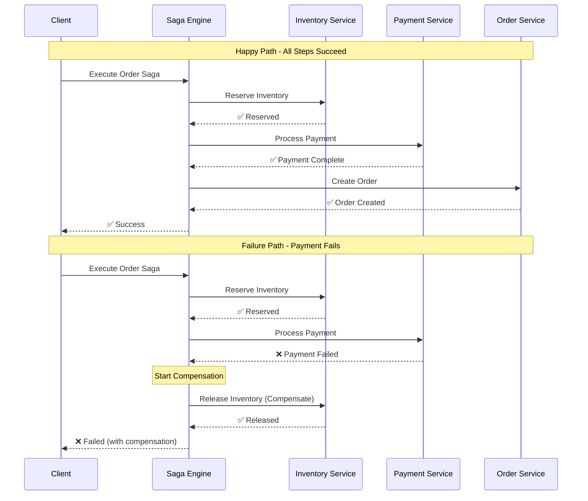
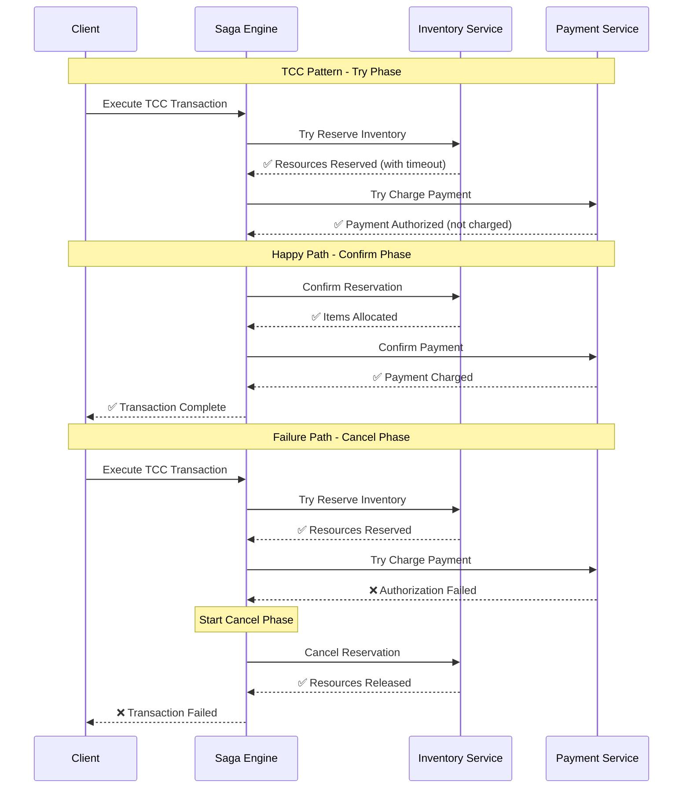
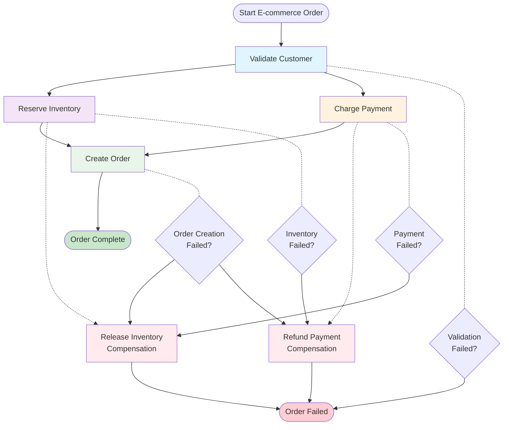
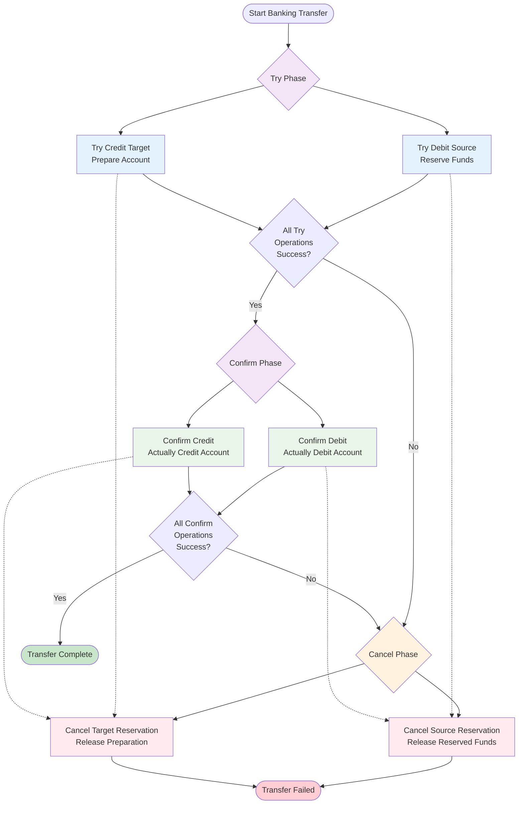

# Saga Patterns vs TCC

Comprehensive comparison of Saga patterns versus Try-Confirm-Cancel (TCC) patterns to help you choose the right approach for your distributed transaction needs.

## Table of Contents

1. [Overview](#overview)
2. [Saga Pattern](#saga-pattern)
3. [TCC Pattern](#tcc-pattern)
4. [Pattern Comparison](#pattern-comparison)
5. [When to Use Each](#when-to-use-each)
6. [Implementation Examples](#implementation-examples)
7. [Migration Strategies](#migration-strategies)
8. [Best Practices](#best-practices)

## Overview

Both Saga and TCC patterns solve the challenge of maintaining consistency across distributed transactions, but they take fundamentally different approaches:

- **Saga Pattern**: Uses compensating actions to undo completed work when failures occur
- **TCC Pattern**: Uses a two-phase commit approach with explicit try, confirm, and cancel operations

## Saga Pattern

### How It Works

The Saga pattern breaks a distributed transaction into a series of local transactions. Each local transaction updates a single service and publishes events or messages to trigger the next step. If any step fails, compensating transactions are executed to undo the changes made by preceding steps.



### Key Characteristics

- **Forward Recovery**: Primary focus on moving forward through the transaction
- **Compensating Actions**: Undo operations to handle failures
- **Asynchronous**: Steps can execute asynchronously
- **Eventually Consistent**: Achieves consistency over time

### Implementation in Transactional Engine

```java
@Component
@Saga(name = "order-processing")
public class OrderProcessingSaga {
    
    @SagaStep(id = "reserve-inventory", compensate = "releaseInventory")
    public Mono<InventoryReservation> reserveInventory(@Input("items") List<OrderItem> items) {
        return inventoryService.reserveItems(items);
    }
    
    @SagaStep(id = "process-payment", compensate = "refundPayment")
    public Mono<PaymentResult> processPayment(@Input("amount") BigDecimal amount) {
        return paymentService.processPayment(amount);
    }
    
    @CompensationSagaStep
    public Mono<Void> releaseInventory(@FromStep("reserve-inventory") InventoryReservation reservation) {
        return inventoryService.releaseReservation(reservation.getReservationId());
    }
    
    @CompensationSagaStep
    public Mono<Void> refundPayment(@FromStep("process-payment") PaymentResult payment) {
        return paymentService.refundPayment(payment.getPaymentId());
    }
}
```

### Advantages

1. **Simplicity**: Straightforward to understand and implement
2. **Performance**: No blocking operations, high throughput
3. **Resilience**: Natural handling of failures through compensation
4. **Scalability**: Supports asynchronous processing
5. **Flexibility**: Easy to add new steps or modify existing ones

### Disadvantages

1. **Eventual Consistency**: Not immediately consistent
2. **Compensation Complexity**: Designing proper compensations can be challenging
3. **Debugging**: Harder to trace execution paths
4. **Dirty Reads**: Intermediate states may be visible to other transactions

## TCC Pattern

### How It Works

TCC breaks each business operation into three phases:
- **Try**: Reserve resources and prepare for the transaction
- **Confirm**: Commit the reserved resources
- **Cancel**: Release the reserved resources if the transaction fails



### Key Characteristics

- **Two-Phase Approach**: Explicit prepare and commit phases
- **Resource Reservation**: Resources are locked during the transaction
- **Synchronous**: Typically requires synchronous communication
- **Strong Consistency**: Maintains ACID properties

### Conceptual Implementation

```java
// TCC is not directly supported by the Transactional Engine
// but can be implemented using saga patterns

@Component
@Saga(name = "tcc-order-processing")
public class TccOrderProcessingSaga {
    
    // Try Phase - Reserve resources
    @SagaStep(id = "try-reserve-inventory")
    public Mono<TccInventoryReservation> tryReserveInventory(@Input("items") List<OrderItem> items) {
        return inventoryService.tryReserveItems(items); // Returns reservation with timeout
    }
    
    @SagaStep(id = "try-charge-payment")
    public Mono<TccPaymentReservation> tryChargePayment(@Input("amount") BigDecimal amount) {
        return paymentService.tryChargePayment(amount); // Authorizes but doesn't charge
    }
    
    // Confirm Phase - Commit resources
    @SagaStep(id = "confirm-inventory", 
              dependsOn = {"try-reserve-inventory", "try-charge-payment"})
    public Mono<Void> confirmInventory(@FromStep("try-reserve-inventory") TccInventoryReservation reservation) {
        return inventoryService.confirmReservation(reservation.getReservationId());
    }
    
    @SagaStep(id = "confirm-payment", 
              dependsOn = {"try-reserve-inventory", "try-charge-payment"})
    public Mono<PaymentResult> confirmPayment(@FromStep("try-charge-payment") TccPaymentReservation reservation) {
        return paymentService.confirmPayment(reservation.getAuthorizationId());
    }
    
    // Cancel Phase - Release resources (compensations)
    @CompensationSagaStep
    public Mono<Void> cancelInventoryReservation(@FromStep("try-reserve-inventory") TccInventoryReservation reservation) {
        return inventoryService.cancelReservation(reservation.getReservationId());
    }
    
    @CompensationSagaStep
    public Mono<Void> cancelPaymentReservation(@FromStep("try-charge-payment") TccPaymentReservation reservation) {
        return paymentService.cancelAuthorization(reservation.getAuthorizationId());
    }
}
```

### Advantages

1. **Strong Consistency**: ACID properties maintained
2. **Isolation**: No dirty reads from incomplete transactions
3. **Predictability**: Clear two-phase approach
4. **Rollback Simplicity**: Explicit cancel operations

### Disadvantages

1. **Complexity**: More complex to implement and maintain
2. **Performance**: Resource locking can create bottlenecks
3. **Availability**: Participants must be available during the entire transaction
4. **Timeouts**: Complex timeout handling for reserved resources
5. **Blocking**: Can create deadlocks and reduce concurrency

## Pattern Comparison

| Aspect | Saga Pattern | TCC Pattern |
|--------|-------------|-------------|
| **Consistency** | Eventually Consistent | Strong Consistency |
| **Performance** | High throughput | Lower throughput due to locking |
| **Complexity** | Lower implementation complexity | Higher implementation complexity |
| **Isolation** | Dirty reads possible | Full isolation |
| **Rollback** | Compensating actions | Explicit cancel operations |
| **Communication** | Asynchronous preferred | Synchronous required |
| **Resource Usage** | Lower resource usage | Higher resource usage (locking) |
| **Failure Handling** | Forward recovery focused | Explicit rollback |
| **Scalability** | Highly scalable | Limited by resource locking |
| **Debugging** | More challenging | Easier to trace |

## When to Use Each

### Choose Saga Pattern When:

1. **High Throughput Required**: Need to process many transactions per second
2. **Asynchronous Operations**: Business process naturally fits async patterns
3. **Eventually Consistent Acceptable**: Business can tolerate temporary inconsistency
4. **Long-Running Processes**: Transactions span minutes or hours
5. **Heterogeneous Systems**: Integrating different technologies and platforms
6. **Microservices Architecture**: Services are loosely coupled
7. **Compensating Actions Feasible**: You can design meaningful compensations

#### Examples:
- E-commerce order processing
- User registration workflows
- Content publishing pipelines
- Data synchronization processes

### Choose TCC Pattern When:

1. **Strong Consistency Required**: Business demands immediate consistency
2. **Short Transactions**: Operations complete quickly (seconds)
3. **Financial Operations**: Money transfers, account updates
4. **Regulatory Requirements**: Strict compliance needs
5. **Limited Participants**: Few services involved in the transaction
6. **Homogeneous Environment**: Similar technologies and protocols
7. **Resource Reservation Natural**: Business operations naturally reserve resources

#### Examples:
- Bank money transfers
- Seat reservations (airlines, theaters)
- Inventory allocation for high-value items
- Account balance updates

## Implementation Examples

### Saga: E-commerce Order

The following flowchart shows the execution flow and dependencies in an e-commerce order saga:



```java
@Saga(name = "ecommerce-order")
public class ECommerceOrderSaga {
    
    @SagaStep(id = "validate-customer")
    public Mono<CustomerInfo> validateCustomer(@Input("customerId") String customerId) {
        // Validate customer - no compensation needed if this fails
        return customerService.validateCustomer(customerId);
    }
    
    @SagaStep(id = "reserve-inventory", compensate = "releaseInventory")
    public Mono<InventoryReservation> reserveInventory(@Input("items") List<OrderItem> items) {
        // Reserve inventory items
        return inventoryService.reserveItems(items);
    }
    
    @SagaStep(id = "charge-payment", compensate = "refundPayment")
    public Mono<PaymentResult> chargePayment(@Input("paymentInfo") PaymentInfo paymentInfo) {
        // Charge customer's payment method
        return paymentService.chargePayment(paymentInfo);
    }
    
    @SagaStep(id = "create-order")
    public Mono<Order> createOrder(@FromStep("reserve-inventory") InventoryReservation inventory,
                                   @FromStep("charge-payment") PaymentResult payment) {
        // Create the final order
        return orderService.createOrder(inventory, payment);
    }
    
    // Compensations execute in reverse order
    @CompensationSagaStep
    public Mono<Void> releaseInventory(@FromStep("reserve-inventory") InventoryReservation reservation) {
        return inventoryService.releaseItems(reservation.getReservationId());
    }
    
    @CompensationSagaStep
    public Mono<Void> refundPayment(@FromStep("charge-payment") PaymentResult payment) {
        return paymentService.refundPayment(payment.getTransactionId());
    }
}
```

### TCC-Style: Banking Transfer

The following flowchart illustrates the TCC-style banking transfer with explicit Try-Confirm-Cancel phases:



```java
@Saga(name = "banking-transfer")
public class BankingTransferSaga {
    
    // Try Phase - Prepare both accounts
    @SagaStep(id = "try-debit-source")
    public Mono<AccountReservation> tryDebitSource(@Input("sourceAccount") String sourceAccount,
                                                   @Input("amount") BigDecimal amount) {
        // Reserve funds in source account (don't actually debit yet)
        return accountService.reserveFunds(sourceAccount, amount);
    }
    
    @SagaStep(id = "try-credit-target")
    public Mono<AccountReservation> tryCreditTarget(@Input("targetAccount") String targetAccount,
                                                    @Input("amount") BigDecimal amount) {
        // Prepare target account for credit (check limits, etc.)
        return accountService.prepareCredit(targetAccount, amount);
    }
    
    // Confirm Phase - Execute both operations
    @SagaStep(id = "confirm-debit", 
              dependsOn = {"try-debit-source", "try-credit-target"})
    public Mono<DebitResult> confirmDebit(@FromStep("try-debit-source") AccountReservation reservation) {
        // Actually debit the source account
        return accountService.confirmDebit(reservation.getReservationId());
    }
    
    @SagaStep(id = "confirm-credit", 
              dependsOn = {"try-debit-source", "try-credit-target"})
    public Mono<CreditResult> confirmCredit(@FromStep("try-credit-target") AccountReservation reservation) {
        // Actually credit the target account
        return accountService.confirmCredit(reservation.getReservationId());
    }
    
    // Cancel Phase - Release reservations
    @CompensationSagaStep
    public Mono<Void> cancelSourceReservation(@FromStep("try-debit-source") AccountReservation reservation) {
        return accountService.cancelReservation(reservation.getReservationId());
    }
    
    @CompensationSagaStep  
    public Mono<Void> cancelTargetReservation(@FromStep("try-credit-target") AccountReservation reservation) {
        return accountService.cancelReservation(reservation.getReservationId());
    }
}
```

## Migration Strategies

### From TCC to Saga

1. **Identify Resource Reservations**: Convert try/confirm patterns to direct operations with compensations
2. **Replace Synchronous Calls**: Move to asynchronous processing where possible
3. **Design Compensations**: Create meaningful undo operations for each step
4. **Handle Eventual Consistency**: Update business logic to handle temporary inconsistency

### From Saga to TCC

1. **Add Resource Reservation**: Implement try/confirm semantics for each operation
2. **Strengthen Consistency**: Ensure operations are truly atomic
3. **Add Timeout Handling**: Implement reservation timeout and cleanup
4. **Synchronize Operations**: Convert asynchronous flows to synchronous where needed

## Best Practices

### Saga Pattern Best Practices

1. **Idempotent Operations**: All steps and compensations must be idempotent
2. **Meaningful Compensations**: Design compensations that make business sense
3. **Timeout Handling**: Implement appropriate timeouts for each step
4. **Event Sourcing**: Consider event sourcing for audit and replay capabilities
5. **Monitoring**: Implement comprehensive monitoring and alerting

```java
@SagaStep(id = "process-payment", 
          timeoutMs = 30000,
          retry = 3)
public Mono<PaymentResult> processPayment(@Input("paymentInfo") PaymentInfo paymentInfo) {
    return paymentService.processPayment(paymentInfo)
        .doOnSuccess(result -> log.info("Payment processed successfully: {}", result.getPaymentId()))
        .doOnError(error -> log.error("Payment processing failed: {}", error.getMessage()));
}
```

### TCC Pattern Best Practices

1. **Timeout Management**: Implement aggressive timeouts for resource reservations
2. **Lease-Based Reservations**: Use time-based leases for resource locks
3. **Deadlock Prevention**: Implement consistent ordering of resource acquisition
4. **Rollback Optimization**: Make cancel operations as fast as possible
5. **Resource Monitoring**: Monitor resource utilization and lock contention

### Common Best Practices

1. **Observability**: Implement detailed logging, metrics, and tracing
2. **Testing**: Create comprehensive tests for both happy path and failure scenarios
3. **Documentation**: Document compensation logic and business rules clearly
4. **Graceful Degradation**: Design systems to continue operating with reduced functionality
5. **Circuit Breakers**: Protect against cascading failures

## Conclusion

Choose the pattern that best fits your specific requirements:

- **Saga** for high-throughput, eventually consistent, asynchronous workflows
- **TCC** for strongly consistent, short-duration, resource-reservation scenarios

The Transactional Engine provides excellent support for Saga patterns and can be adapted to implement TCC-style workflows when needed. Consider starting with Saga patterns for their simplicity and flexibility, and only move to TCC when strong consistency is absolutely required.